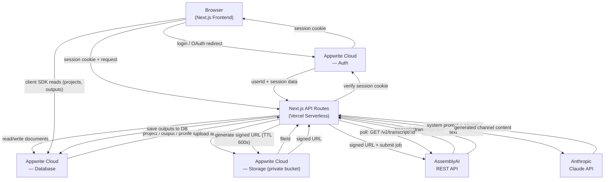
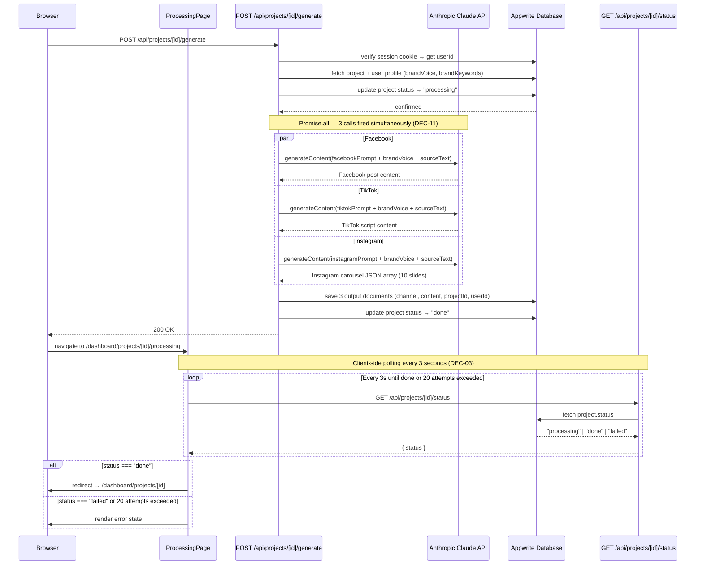
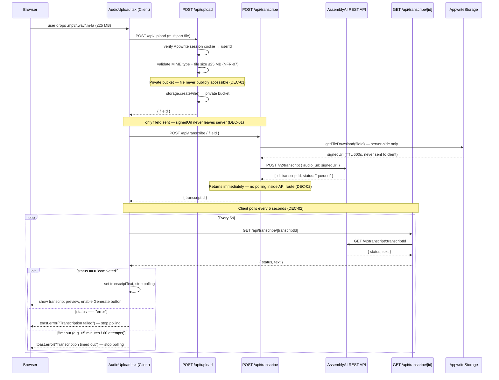
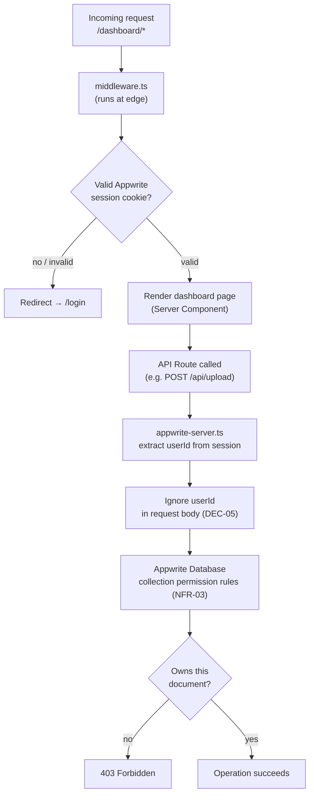
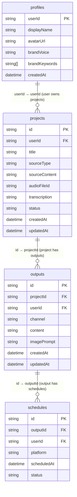

# AI Multi-Studio — Architecture Document

---

## 1. System Overview

AI Multi-Studio accepts one of three raw content sources from the user — a URL (scraped server-side by Cheerio), plain text (pasted directly), or an audio file (uploaded to Appwrite Storage, transcribed by AssemblyAI) — normalises all three paths into a single plain-text source string, and then triggers parallel calls to the Google Gemini API (`gemini-2.0-flash`) to produce three platform-optimised social media posts simultaneously: a Facebook storytelling post, a TikTok video script with scene labels, and an Instagram 10-slide carousel with caption and hashtags. The system is built on Next.js 14 (App Router) deployed to Vercel, uses Appwrite Cloud for authentication (Google OAuth + email/password), document storage (four collections: `profiles`, `projects`, `outputs`, `schedules`), and file storage (private audio bucket), and uses Recharts for basic usage analytics and Sonner for in-app notifications. Users can preview, inline-edit, regenerate per channel, export outputs as `.txt` or `.json`, and schedule posts for display in a lightweight scheduler view.

---

## 2. High-Level Architecture Diagram

---

## 3. Request Lifecycle — Content Generation

---

## 4. Request Lifecycle — Audio Transcription

---

## 5. Authentication & Security Model

### Prose

**Edge middleware (DEC-10):** `middleware.ts` at the project root intercepts every request to `/dashboard/*` before any page renders. It reads the Appwrite session cookie from the request headers and validates it against Appwrite Cloud. If no valid session exists, the request is redirected to `/login` at the edge — the dashboard server components and layouts never execute.

**Session verification in API routes (DEC-05):** Every API route uses the Appwrite server SDK (`src/lib/appwrite-server.ts`) to extract the authenticated user's identity from the session cookie. The `userId` is derived exclusively from this verified session object. Any `userId` value present in a request body or query parameter is silently ignored. This prevents any authenticated user from acting on another user's data by spoofing a `userId`.

**Collection-level security rules (NFR-03):** Each Appwrite collection (`profiles`, `projects`, `outputs`, `schedules`) is configured with permission rules that restrict read and write access to the document's owning `userId` only. Even if an API route bug allowed a wrong `userId` to be used, Appwrite would reject the operation at the database level as a second line of defence.

### Auth Flow Diagram

---

## 6. Data Flow — Brand Voice Injection

When a user saves their brand settings (FR-SET-02, FR-SET-03), two fields are written to their document in the Appwrite `profiles` collection: `brandVoice` (one of `"energetic"`, `"educational"`, `"funny"`, `"calm"`) and `brandKeywords` (an array of up to 10 strings).

When `POST /api/projects/[id]/generate` is called, the route first fetches the authenticated user's `profiles` document from Appwrite using the server SDK (the `userId` is sourced from the verified session per DEC-05). The `brandVoice` and `brandKeywords` values are then interpolated into each of the three channel prompt strings — facebook, tiktok, and instagram — before those prompts are passed to `generateContent()` in `src/lib/ai.ts` (FR-GEN-06).

Because all three Claude calls are fired in parallel via `Promise.all` (DEC-11), the brand voice is applied consistently and simultaneously across every channel. The resulting output content stored in the `outputs` collection therefore already reflects the user's chosen tone and keywords — no post-processing step is required. Future regenerations via `POST /api/outputs/[id]/regenerate` follow the same pattern: the route fetches the profile before calling `streamContent()`.

---

## 7. Component Architecture

```mermaid
flowchart TD
    Layout["dashboard/layout.tsx\n(Server Component — profile auto-creation DEC-04)"]
    Sidebar["Sidebar.tsx\n(logout, nav links)"]
    TopBar["TopBar.tsx\n(responsive header)"]

    DashPage["dashboard/page.tsx\n(project grid, stats, analytics)"]
    RechartsChart["Recharts BarChart\n(projects per day — Client Component)"]

    NewPage["dashboard/new/page.tsx\n(new project — Client Component)"]
    SourceSelector["SourceTypeSelector.tsx"]
    UrlInput["UrlInput.tsx\n(calls /api/scrape)"]
    TextInput["TextInput.tsx\n(live char count)"]
    AudioUpload["AudioUpload.tsx\n(polls /api/transcribe/[id] DEC-02)"]

    ProcessingPage["dashboard/projects/[id]/processing/page.tsx\n(polls /api/projects/[id]/status DEC-03 — Client Component)"]

    PreviewPage["dashboard/projects/[id]/page.tsx\n(preview & edit — Client Component)"]
    ChannelTabs["ChannelTabs.tsx\n(Facebook / TikTok / Instagram switcher)"]
    FacebookPreview["FacebookPreview.tsx\n(post card + word count)"]
    TikTokPreview["TikTokPreview.tsx\n(script + scene labels)"]
    InstagramPreview["InstagramPreview.tsx\n(10-slide carousel via JSON.parse DEC-06)"]
    ImagePromptButton["ImagePromptButton.tsx\n(calls /api/outputs/[id]/image-prompt DEC-12)"]

    SettingsPage["dashboard/settings/page.tsx\n(display name, avatar, brand voice, keywords)"]
    SchedulerPage["dashboard/scheduler/page.tsx\n(scheduled posts list)"]

    Layout --> Sidebar
    Layout --> TopBar
    Layout --> DashPage
    Layout --> NewPage
    Layout --> ProcessingPage
    Layout --> PreviewPage
    Layout --> SettingsPage
    Layout --> SchedulerPage

    DashPage --> RechartsChart

    NewPage --> SourceSelector
    NewPage --> UrlInput
    NewPage --> TextInput
    NewPage --> AudioUpload

    PreviewPage --> ChannelTabs
    PreviewPage --> FacebookPreview
    PreviewPage --> TikTokPreview
    PreviewPage --> InstagramPreview
    PreviewPage --> ImagePromptButton
```

---

## 8. Database Architecture

---

## 9. Key Architectural Decisions Summary

| Decision | Problem Solved | Architectural Impact |
|---|---|---|
| DEC-01 | Appwrite Storage bucket visibility not specified; public bucket would expose all user audio files | Bucket is private; `POST /api/upload` generates a server-side signed URL (TTL 600s) used once for AssemblyAI — signed URL never stored or returned to client |
| DEC-02 | AssemblyAI transcription takes up to 5 minutes; Vercel serverless functions time out at 10 seconds | `POST /api/transcribe` submits job and returns `transcriptId` immediately; browser polls `GET /api/transcribe/[id]` every 5s — polling loop lives entirely on the client |
| DEC-03 | FR-GEN-05 left generation status delivery mechanism unspecified (SSE or polling) | Processing page polls `GET /api/projects/[id]/status` every 3s; redirects on `"done"`, errors after 20 failed attempts — no persistent server connection required |
| DEC-04 | FR-AUTH-04 required profile creation on first login but no implementation location was specified | `dashboard/layout.tsx` server component checks for and creates the `profiles` document before any child page renders — guaranteed to run on every dashboard route |
| DEC-05 | API routes could be exploited by passing a fake `userId` in the request body | Every API route derives `userId` exclusively from the verified Appwrite session cookie via server SDK; client-supplied `userId` values are ignored |
| DEC-06 | `outputs.content` is a single string but Instagram requires 10 slides, a caption, and 30 hashtags | Instagram prompt returns a JSON object `{ slides, caption, hashtags }` (see AI_LAYER.md); `InstagramPreview.tsx` calls `JSON.parse(content)` — parse errors are catchable unlike delimiter-based formats |
| DEC-07 | `projects.title` required for all source types but only URL had a natural title source | Title auto-derived: URL → `<title>` tag; Text → first 8 words + `"..."`; Audio → filename + upload date (`YYYY-MM-DD`) |
| DEC-08 | FR-DASH-04 cascade delete omitted `schedules` collection, which holds `outputId` foreign keys | Deletion executes in strict order: `schedules` → `outputs` → `projects`; any step failure halts sequence and surfaces error to user |
| DEC-09 | FR-PREV-05 requires streaming for per-channel regenerate but existing generation was non-streaming | `ai.ts` exports two separate functions: `generateContent()` (non-streaming `Promise<string>`) for initial parallel generation; `streamContent()` (`ReadableStream`) for regenerate endpoint only |
| DEC-10 | FR-AUTH-03 required `/dashboard/*` protection but layout-level redirects risk flashing protected content | `middleware.ts` at project root blocks unauthenticated requests at the edge before any server component executes; dashboard layout does not duplicate the auth check |
| DEC-11 | FR-GEN-01 required parallel generation but sequential calls (~5s × 3) would breach the 15-second NFR-01 budget | `POST /api/projects/[id]/generate` uses `Promise.all([facebook, tiktok, instagram])` — total latency equals the slowest single Claude call, not the sum |
| DEC-12 | FR-PREV-06 image prompt feature had no implementation home; reusing `PUT /api/outputs/[id]` would conflate two distinct operations | Dedicated route `POST /api/outputs/[id]/image-prompt` with its own system prompt in `lib/prompts/image-prompt.ts`; result saved to `outputs.imagePrompt` field separately from `content` |
