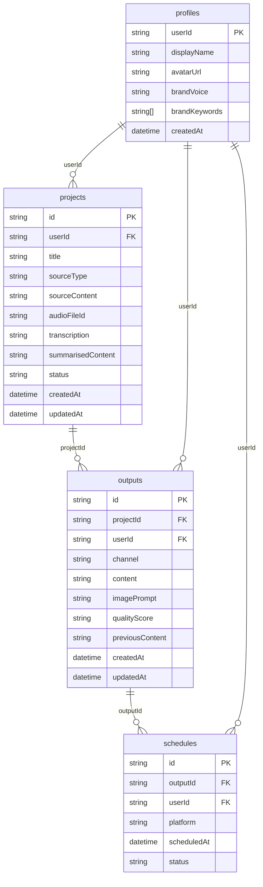

# AI Multi-Studio — Database Design

---

## 1. Database Overview

AI Multi-Studio uses **Appwrite Cloud** as its database provider, a managed document database (NoSQL) accessed via the `appwrite@14` SDK. The database contains **four collections**: `profiles` (stores per-user settings and brand voice configuration), `projects` (stores each content-generation job and its source material), `outputs` (stores the platform-specific generated content for each project), and `schedules` (stores display-only post scheduling records). Security is enforced at two levels per NFR-03 and DEC-05: collection-level Appwrite permission rules ensure every document is readable and writable only by the owning user's `userId`, while every API route additionally derives `userId` exclusively from the verified server-side session cookie — never from the request body — making spoofed identity attacks impossible at both the application and database layers. Because Appwrite is a document database, there are no SQL joins; inter-collection relationships are modelled as **foreign key fields** (plain string attributes storing a referenced document's ID), and the application code assembles related data by issuing separate queries per collection — for example, fetching all `outputs` where `projectId` matches a given project ID.

---

## 2. Collection Schemas (Detailed)

### profiles

**Collection ID:** `NEXT_PUBLIC_APPWRITE_PROFILES_COLLECTION_ID`
**Purpose:** Stores one document per authenticated user containing their display name, avatar, and brand voice settings injected into every Claude generation call.

| Field | Type | Required | Default | Constraints | Description |
|---|---|---|---|---|---|
| `userId` | string | yes | — | Appwrite Auth UID; unique across collection | The Appwrite Auth user ID; used as foreign key from projects, outputs, schedules |
| `displayName` | string | yes | `""` | max 128 chars | User's chosen display name shown in TopBar and Settings |
| `avatarUrl` | string | no | `""` | valid URL or empty string | URL to avatar image stored in Appwrite Storage |
| `brandVoice` | string | yes | `"energetic"` | enum: `"energetic"` \| `"educational"` \| `"funny"` \| `"calm"` | Tone injected into every Claude prompt (FR-GEN-06, FR-SET-02) |
| `brandKeywords` | string[] | no | `[]` | max 10 items; each item max 50 chars | Keywords injected into every Claude prompt (FR-SET-03, FR-GEN-06) |
| `createdAt` | datetime | yes | server timestamp at creation | ISO 8601 | Timestamp when the profile document was first created |

**Indexes to create:**
- `userId` — supports `getOrCreateProfile()` lookup in `dashboard/layout.tsx` (DEC-04); must be unique to enforce one profile per user

**Appwrite permission rules:**
- Read: user with matching `userId` only (`user:{userId}`)
- Create: any authenticated user (creation happens once on first dashboard visit via server SDK — DEC-04)
- Update: user with matching `userId` only
- Delete: user with matching `userId` only

---

### projects

**Collection ID:** `NEXT_PUBLIC_APPWRITE_PROJECTS_COLLECTION_ID`
**Purpose:** Stores one document per content-generation job, including source material, auto-generated title, processing status, and a reference to any uploaded audio file.

| Field | Type | Required | Default | Constraints | Description |
|---|---|---|---|---|---|
| `userId` | string | yes | — | Appwrite Auth UID; non-empty | Foreign key to `profiles.userId`; set from verified session (DEC-05) |
| `title` | string | yes | — | max 256 chars; non-empty | Auto-derived title per DEC-07: URL → `<title>` tag; Text → first 8 words + `"..."`; Audio → filename + `YYYY-MM-DD` |
| `sourceType` | string | yes | — | enum: `"url"` \| `"text"` \| `"audio"` | Which input path was used to create this project (FR-INPUT-01) |
| `sourceContent` | string | yes | `""` | No hard max; stores raw scraped/pasted/transcribed text | The plain-text source material passed to AI prompts |
| `audioFileId` | string | no | `""` | Appwrite Storage file ID or empty string | ID of the uploaded audio file in the private storage bucket (DEC-01); used for potential re-transcription |
| `transcription` | string | no | `""` | No hard max | The transcript text returned by AssemblyAI; stored here for reference; mirrors `sourceContent` for audio projects |
| `summarisedContent` | string | no | `""` | No hard max; ~3,000 chars expected | **[Expansion W9]** AI-condensed version of `sourceContent` when original exceeds 8,000 chars (DEC-25). Generate route uses `summarisedContent || sourceContent` as prompt input. Overwritten if user edits the source preview panel. |
| `status` | string | yes | `"pending"` | enum: `"pending"` \| `"processing"` \| `"done"` \| `"failed"` | Lifecycle state of the generation job; polled by processing page (DEC-03) |
| `createdAt` | datetime | yes | server timestamp at creation | ISO 8601 | Timestamp of project creation |
| `updatedAt` | datetime | yes | server timestamp at update | ISO 8601 | Timestamp of last status change or field update |

**Indexes to create:**
- `userId` — supports dashboard query "get all projects by user" (FR-DASH-01); used on every dashboard page load
- `userId + createdAt` (composite) — supports analytics query "projects created in last 28 days" (FR-ANAL-02, FR-ANAL-05) and sorted project grid
- `status` — supports dashboard filter by status badge; also used by `GET /api/projects/[id]/status` return path

**Appwrite permission rules:**
- Read: user with matching `userId` only
- Create: any authenticated user (via server SDK in `dashboard/new/page.tsx` flow)
- Update: user with matching `userId` only (status transitions set by API routes per DEC-05)
- Delete: user with matching `userId` only (cascade delete order enforced in application code — DEC-08)

---

### outputs

**Collection ID:** `NEXT_PUBLIC_APPWRITE_OUTPUTS_COLLECTION_ID`
**Purpose:** Stores one document per platform-specific generated output (up to 5 per project), including the content string, an optional image prompt, and a reference back to the project and user.

| Field | Type | Required | Default | Constraints | Description |
|---|---|---|---|---|---|
| `projectId` | string | yes | — | Non-empty; references `projects.$id` | Foreign key linking this output to its parent project |
| `userId` | string | yes | — | Appwrite Auth UID; non-empty | Foreign key to `profiles.userId`; denormalised here for direct per-user queries and permission enforcement (DEC-05) |
| `channel` | string | yes | — | enum: `"facebook"` \| `"tiktok"` \| `"instagram"` \| `"linkedin"` \| `"twitter"` | The social media platform this output is written for (FR-GEN-02) |
| `content` | string | yes | `""` | No hard max; must accommodate Instagram JSON object (DEC-06, AI_LAYER.md); ~5000–8000 chars expected | The generated content; for Instagram: a raw JSON object string `{slides, caption, hashtags}` parsed by `InstagramPreview.tsx` (DEC-06, AI_LAYER.md) |
| `imagePrompt` | string | no | `""` | No hard max; ~500 chars expected | The image prompt generated by `POST /api/outputs/[id]/image-prompt` (DEC-12); stored separately from `content` |
| `qualityScore` | string | no | `""` | No hard max; ~200 chars expected | **[Expansion W9]** JSON string `{ total, hook, cta, platformFit, brandAlignment, tip }` generated by `POST /api/outputs/[id]/score` (DEC-21). Stored as raw JSON string following the DEC-06 pattern. `QualityScoreBadge.tsx` calls `JSON.parse(qualityScore)` with try/catch. |
| `previousContent` | string | no | `""` | No hard max; same size as `content` field | **[Expansion W8]** Snapshot of `content` before the most recent overwrite (inline edit or regeneration). Enables one-level undo via "Restore Previous Version" button (DEC-22). Overwritten on every subsequent content write. |
| `createdAt` | datetime | yes | server timestamp at creation | ISO 8601 | Timestamp when this output was first saved after generation |
| `updatedAt` | datetime | yes | server timestamp at update | ISO 8601 | Timestamp of last inline edit, regeneration, or score update |

**Indexes to create:**
- `projectId` — supports "get all outputs for a project" query on preview page; core to rendering the 5-tab preview (DEC-20)
- `userId` — supports analytics query "total outputs by platform" (FR-ANAL-01, FR-ANAL-03) and cascade delete lookup (DEC-08)
- `projectId + channel` (composite) — supports single-channel lookup for regenerate and score routes

**Appwrite permission rules:**
- Read: user with matching `userId` only
- Create: any authenticated user via server SDK (outputs created exclusively by generation route)
- Update: user with matching `userId` only (inline edit via `PUT /api/outputs/[id]`; image prompt via DEC-12; quality score via DEC-21; hashtag refresh via DEC-26)
- Delete: user with matching `userId` only (cascade delete triggered before project delete — DEC-08)

---

### schedules

**Collection ID:** `NEXT_PUBLIC_APPWRITE_SCHEDULES_COLLECTION_ID`
**Purpose:** Stores display-only scheduled post entries, each linking an output to a future date/time; no actual publishing occurs (FR-SCHED-04).

| Field | Type | Required | Default | Constraints | Description |
|---|---|---|---|---|---|
| `outputId` | string | yes | — | Non-empty; references `outputs.$id` | Foreign key to the output document being scheduled |
| `userId` | string | yes | — | Appwrite Auth UID; non-empty | Foreign key to `profiles.userId`; denormalised for direct per-user queries and permission enforcement (DEC-05) |
| `platform` | string | yes | — | enum: `"facebook"` \| `"tiktok"` \| `"instagram"` \| `"linkedin"` \| `"twitter"` | Platform this post is scheduled for; mirrors `outputs.channel` |
| `scheduledAt` | datetime | yes | — | Must be a future datetime at creation time | The user-selected date and time for the post to go out |
| `status` | string | yes | `"pending"` | enum: `"pending"` \| `"sent"` \| `"cancelled"` | Display-only lifecycle status shown on scheduler page (FR-SCHED-03) |

**Indexes to create:**
- `userId` — supports "get all schedules by user" on scheduler page (FR-SCHED-03)
- `outputId` — supports cascade delete lookup: "delete all schedules for a given outputId" (DEC-08); critical to orphan prevention
- `userId + scheduledAt` (composite) — supports scheduler page sort by upcoming date

**Appwrite permission rules:**
- Read: user with matching `userId` only
- Create: any authenticated user (schedule created from preview page — FR-SCHED-02)
- Update: user with matching `userId` only (status changes: pending → cancelled)
- Delete: user with matching `userId` only (cascade delete first step — DEC-08)

---

## 3. Entity Relationship Diagram



---

## 4. Query Patterns

### QRY-01: Get profile by userId
**Collection:** profiles
**Operation:** list
**Filters:** `userId == <sessionUserId>`
**Order by:** none (expect 0 or 1 result)
**Called from:** `src/app/dashboard/layout.tsx` (server component, DEC-04); `src/lib/appwrite-server.ts` → `getOrCreateProfile()`
**DEC reference:** DEC-04, DEC-05

---

### QRY-02: Create profile on first login
**Collection:** profiles
**Operation:** create
**Filters:** none (document creation)
**Order by:** n/a
**Called from:** `src/app/dashboard/layout.tsx` via `src/lib/appwrite-server.ts` → `getOrCreateProfile()` — only executed when QRY-01 returns 0 documents
**DEC reference:** DEC-04

---

### QRY-03: Create project on input submit
**Collection:** projects
**Operation:** create
**Filters:** none (document creation)
**Order by:** n/a
**Called from:** `src/app/dashboard/new/page.tsx` — called after source content is ready, sets `status: "pending"` (FR-INPUT-05)
**DEC reference:** DEC-07

---

### QRY-04: Get all projects by userId (dashboard)
**Collection:** projects
**Operation:** list
**Filters:** `userId == <sessionUserId>`
**Order by:** `createdAt` descending
**Called from:** `src/app/dashboard/page.tsx` — populates the project grid (FR-DASH-01); also used by analytics stats cards (FR-ANAL-01)
**DEC reference:** none

---

### QRY-05: Get project by id (generate route)
**Collection:** projects
**Operation:** get
**Filters:** document ID == `<projectId>`
**Order by:** n/a
**Called from:** `src/app/api/projects/[id]/generate/route.ts` — fetches `sourceContent` and `userId` before calling Claude; ownership verified against session (DEC-05)
**DEC reference:** DEC-05, DEC-11

---

### QRY-06: Get project by id (preview page)
**Collection:** projects
**Operation:** get
**Filters:** document ID == `<projectId>`
**Order by:** n/a
**Called from:** `src/app/dashboard/projects/[id]/page.tsx` — fetches project metadata to render title and source type on preview page
**DEC reference:** none

---

### QRY-07: Update project status (pending → processing → done → failed)
**Collection:** projects
**Operation:** update
**Filters:** document ID == `<projectId>`
**Order by:** n/a
**Called from:** `src/app/api/projects/[id]/generate/route.ts` via `src/lib/appwrite-server.ts` → `updateProjectStatus()` — called three times: set `"processing"` at start, `"done"` on `Promise.all` resolve, `"failed"` on `Promise.all` reject
**DEC reference:** DEC-05, DEC-11

---

### QRY-08: Create output (×3 after generation)
**Collection:** outputs
**Operation:** create
**Filters:** none (document creation)
**Order by:** n/a
**Called from:** `src/app/api/projects/[id]/generate/route.ts` via `src/lib/appwrite-server.ts` → `createOutput()` — called three times (facebook, tiktok, instagram) after `Promise.all` resolves (DEC-11)
**DEC reference:** DEC-05, DEC-06, DEC-11

---

### QRY-09: Get outputs by projectId (preview page)
**Collection:** outputs
**Operation:** list
**Filters:** `projectId == <projectId>`
**Order by:** `createdAt` ascending (facebook, tiktok, instagram in creation order)
**Called from:** `src/app/dashboard/projects/[id]/page.tsx` — fetches all outputs to populate channel tabs (FR-PREV-01)
**DEC reference:** none

---

### QRY-10: Update output content (inline edit)
**Collection:** outputs
**Operation:** update
**Filters:** document ID == `<outputId>`
**Order by:** n/a
**Called from:** `src/app/api/outputs/[id]/route.ts` (PUT handler) — triggered by auto-save on blur in preview page (FR-PREV-04); updates `content` field and sets `updatedAt`
**DEC reference:** DEC-05

---

### QRY-11: Update output imagePrompt field
**Collection:** outputs
**Operation:** update
**Filters:** document ID == `<outputId>`
**Order by:** n/a
**Called from:** `src/app/api/outputs/[id]/image-prompt/route.ts` — saves Claude's image prompt result to `imagePrompt` field only; does not touch `content` (DEC-12)
**DEC reference:** DEC-05, DEC-12

---

### QRY-12: Get project status (polling route)
**Collection:** projects
**Operation:** get
**Filters:** document ID == `<projectId>`
**Order by:** n/a
**Called from:** `src/app/api/projects/[id]/status/route.ts` — called every 3 seconds by `processing/page.tsx` polling loop until `"done"` or `"failed"` (DEC-03)
**DEC reference:** DEC-03, DEC-05

---

### QRY-13: Delete schedules by outputId (cascade step 1)
**Collection:** schedules
**Operation:** list then delete
**Filters:** `outputId == <outputId>` (repeated for each output in the project)
**Order by:** n/a
**Called from:** `src/app/dashboard/page.tsx` cascade delete handler via `src/lib/appwrite-server.ts` → `deleteProjectCascade()` — executed first in the cascade sequence before outputs are deleted (DEC-08)
**DEC reference:** DEC-08

---

### QRY-14: Delete outputs by projectId (cascade step 2)
**Collection:** outputs
**Operation:** list then delete
**Filters:** `projectId == <projectId>`
**Order by:** n/a
**Called from:** `src/app/dashboard/page.tsx` cascade delete handler via `src/lib/appwrite-server.ts` → `deleteProjectCascade()` — executed after schedules are deleted, before the project document is deleted (DEC-08)
**DEC reference:** DEC-08

---

### QRY-15: Delete project by id (cascade step 3)
**Collection:** projects
**Operation:** delete
**Filters:** document ID == `<projectId>`
**Order by:** n/a
**Called from:** `src/app/dashboard/page.tsx` cascade delete handler via `src/lib/appwrite-server.ts` → `deleteProjectCascade()` — final step after all schedules and outputs are removed (DEC-08)
**DEC reference:** DEC-08

---

### QRY-16: Get all schedules by userId (scheduler page)
**Collection:** schedules
**Operation:** list
**Filters:** `userId == <sessionUserId>`
**Order by:** `scheduledAt` ascending (soonest first)
**Called from:** `src/app/dashboard/scheduler/page.tsx` — populates the full scheduled posts list with status badges (FR-SCHED-03)
**DEC reference:** none

---

### QRY-17: Create schedule (scheduler feature)
**Collection:** schedules
**Operation:** create
**Filters:** none (document creation)
**Order by:** n/a
**Called from:** `src/app/dashboard/projects/[id]/page.tsx` — triggered by date/time picker submit on preview page (FR-SCHED-01, FR-SCHED-02); sets `status: "pending"`
**DEC reference:** none

---

### QRY-18: Get outputs by userId (analytics)
**Collection:** outputs
**Operation:** list
**Filters:** `userId == <sessionUserId>`
**Order by:** n/a
**Called from:** `src/app/dashboard/page.tsx` — used to compute "total outputs" stat card and "outputs by platform" breakdown (FR-ANAL-01)
**DEC reference:** none

---

### QRY-19: Get projects for last-7-days chart
**Collection:** projects
**Operation:** list
**Filters:** `userId == <sessionUserId>` AND `createdAt >= <7DaysAgo>`
**Order by:** `createdAt` ascending
**Called from:** `src/app/dashboard/page.tsx` — data source for Recharts bar chart grouped by day (FR-ANAL-02, FR-ANAL-05)
**DEC reference:** none

---

### QRY-20: Update project source content and/or title (Expansion W8)
**Collection:** projects
**Operation:** update
**Filters:** document ID == `<projectId>`
**Order by:** n/a
**Called from:** `src/app/api/projects/[id]/source/route.ts` (PUT handler) — triggered on textarea blur in source preview panel (FR-SRC-03); also called after auto-summarisation saves `summarisedContent` (DEC-25)
**DEC reference:** DEC-05, DEC-25

---

### QRY-21: Create duplicate project (Expansion W8)
**Collection:** projects
**Operation:** create
**Filters:** none (document creation)
**Order by:** n/a
**Called from:** `src/app/api/projects/[id]/duplicate/route.ts` — triggered by Duplicate button on dashboard project card (FR-DUP-02)
**DEC reference:** DEC-05, DEC-23

---

### QRY-22: Update output qualityScore field (Expansion W9)
**Collection:** outputs
**Operation:** update
**Filters:** document ID == `<outputId>`
**Order by:** n/a
**Called from:** `src/app/api/outputs/[id]/score/route.ts` — saves the JSON score string after AI evaluation (FR-SCORE-02). Also triggered after regeneration (FR-SCORE-05).
**DEC reference:** DEC-05, DEC-21

---

### QRY-23: Update output content with previousContent snapshot (Expansion W8)
**Collection:** outputs
**Operation:** update (read + update)
**Filters:** document ID == `<outputId>`
**Order by:** n/a
**Called from:** `src/app/api/outputs/[id]/route.ts` (PUT) and `src/app/api/outputs/[id]/regenerate/route.ts` — each reads current `content` into `previousContent` before overwriting `content` (DEC-22)
**DEC reference:** DEC-05, DEC-22

---

### QRY-24: Update Instagram content with new hashtags in-place (Expansion W9)
**Collection:** outputs
**Operation:** update
**Filters:** document ID == `<outputId>`
**Order by:** n/a
**Called from:** `src/app/api/outputs/[id]/hashtags/route.ts` — writes merged `{ slides, caption, hashtags: newHashtags }` JSON string back to `content` field (DEC-26)
**DEC reference:** DEC-05, DEC-06, DEC-26

---

### QRY-25: Get projects filtered to last 28 days for extended trend chart (Expansion W8)
**Collection:** projects
**Operation:** list
**Filters:** `userId == <sessionUserId>` AND `createdAt >= <28DaysAgo>`
**Order by:** `createdAt` ascending
**Called from:** `src/app/dashboard/page.tsx` — data source for expanded 28-day `LineChart` (FR-ANAL-05); replaces the 7-day query used by the original `BarChart`
**DEC reference:** none

---

### QRY-26: Get outputs grouped by channel for platform breakdown chart (Expansion W8)
**Collection:** outputs
**Operation:** list
**Filters:** `userId == <sessionUserId>`
**Order by:** n/a (client-side grouping by `channel` field)
**Called from:** `src/app/dashboard/page.tsx` — same query as QRY-18; client groups results by `channel` to compute platform breakdown chart (FR-ANAL-03). No additional Appwrite query needed.
**DEC reference:** none

---

## 5. Data Validation Rules

| Collection | Field | Client validation | Server validation |
|---|---|---|---|
| projects | `sourceType` | UI tab selection enforces one of `"url"` \| `"text"` \| `"audio"` — no free-text input | API route (or Appwrite attribute enum) rejects any value outside the three allowed strings |
| projects | `status` | Not editable by the client directly; transitions are only possible via API routes | `updateProjectStatus()` in `appwrite-server.ts` accepts only `"pending"` \| `"processing"` \| `"done"` \| `"failed"`; any other value throws before writing |
| projects | `summarisedContent` | Source preview panel shows a character count; user edits replace `summarisedContent` not `sourceContent` | `PUT /api/projects/[id]/source` accepts any string or empty string; no max length enforced server-side (content is already AI-condensed to ~3,000 chars) |
| outputs | `channel` | Channel is set server-side by the generate route based on `Promise.all` array position — client never sends this value | Generate route hardcodes 5 channel strings `"facebook"`, `"tiktok"`, `"instagram"`, `"linkedin"`, `"twitter"`; regenerate route reads existing `channel` from DB; Appwrite enum attribute rejects unknown values (DEC-20) |
| outputs | `content` (Instagram) | `InstagramPreview.tsx` wraps `JSON.parse(content)` in try/catch; accesses `parsed.slides`, `parsed.caption`, `parsed.hashtags`; on failure renders a visible error card with the raw string rather than crashing | Generate route calls `JSON.parse(instagramContent)` and verifies `result.slides.length === 10 && result.caption.length <= 150 && result.hashtags.length === 30` before saving; on guard failure marks project `"failed"` — no retry (DEC-18); hashtag optimiser route validates `newHashtags.length === 30` before merging (DEC-26) |
| outputs | `qualityScore` | `QualityScoreBadge.tsx` wraps `JSON.parse(qualityScore)` in try/catch; on failure renders "—" placeholder — does not crash | `POST /api/outputs/[id]/score` validates invariant `hook + cta + platformFit + brandAlignment === total` after parsing; returns `SCORE_FAILED` (400) on failure; no partial save (DEC-21) |
| outputs | `previousContent` | "Restore Previous Version" button is only rendered when `previousContent` is non-empty | `PUT /api/outputs/[id]` and regenerate route both write `previousContent: existing.content` alongside the new `content` — no separate validation needed (DEC-22) |
| schedules | `status` | Scheduler page only exposes a "Cancel" button (sets `"cancelled"`); no raw status field is shown | API route accepts only `"pending"` \| `"sent"` \| `"cancelled"`; client-supplied status outside this set is rejected |
| profiles | `brandVoice` | Settings page renders a fixed 4-option radio/select — `"energetic"` \| `"educational"` \| `"funny"` \| `"calm"` — no free text allowed | `appwrite-server.ts` profile update validates value is one of the four allowed strings before writing to Appwrite |
| profiles | `brandKeywords` | Tag input enforces a max of 10 tags and shows a counter; 11th tag add attempt is blocked in UI (FR-SET-03) | Server validates `brandKeywords.length <= 10` before calling Appwrite update; returns 400 if exceeded |
| storage | audio file upload | `AudioUpload.tsx` checks `file.size <= 25 * 1024 * 1024` and `file.type` is one of `audio/mpeg`, `audio/wav`, `audio/x-m4a` before calling `POST /api/upload`; surfaces user-readable error on failure (FR-INPUT-07) | `POST /api/upload` re-validates MIME type against allowlist (`audio/mpeg`, `audio/wav`, `audio/x-m4a`) and file size `<= 25MB` server-side before calling `storage.createFile()` (NFR-07); returns 400 with structured error on violation |

---

## 6. Data Lifecycle

### profiles

**Created:** On first visit to any `/dashboard/*` route after authentication. `dashboard/layout.tsx` server component calls `getOrCreateProfile()` in `src/lib/appwrite-server.ts`; if no document with the authenticated `userId` exists, one is created with default values (`brandVoice: "energetic"`, `brandKeywords: []`, `displayName: ""`) (DEC-04).

**Updated:** When the user saves changes on the settings page (`src/app/dashboard/settings/page.tsx`). Fields that may change: `displayName`, `avatarUrl`, `brandVoice`, `brandKeywords`.

**Deleted:** No in-app deletion path. Profile documents persist as long as the user's Appwrite Auth account exists. If account deletion is ever added post-internship, the profile document must be deleted as part of that flow.

**Orphan risk:** No — profiles are owned by an active Auth user and are never referenced as a FK in a query that could leave them stranded. However, if an Auth account is deleted externally (e.g., via Appwrite Console), the profile document becomes orphaned. Acceptable for current scope.

---

### projects

**Created:** When the user submits a new project via `src/app/dashboard/new/page.tsx`. Status starts at `"pending"`. Created via server SDK in `POST /api/projects/[id]/generate` flow.

**Updated:**
- Status → `"processing"`: set at the start of `POST /api/projects/[id]/generate` before `Promise.all` fires
- Status → `"done"`: set after all 3 `Promise.all` calls resolve and outputs are saved
- Status → `"failed"`: set if `Promise.all` rejects (any one Claude call fails)
- `updatedAt` is refreshed on every status change

**Deleted:** Via cascade delete triggered by the user confirming deletion on the dashboard (`src/app/dashboard/page.tsx`). Must be preceded by deletion of all child `outputs` (and their child `schedules`) in the order: schedules → outputs → project (DEC-08).

**Orphan risk:** No — projects are deleted only via explicit user action with cascade. However, if the cascade delete sequence halts mid-way (e.g., outputs deleted but project delete fails), the application surfaces an error and leaves the partial state visible to the user rather than silently orphaning outputs. The user must retry.

---

### outputs

**Created:** Exclusively by `POST /api/projects/[id]/generate` — three documents are created atomically after `Promise.all` resolves, one per channel (facebook, tiktok, instagram) (DEC-11). An output is never created independently.

**Updated:**
- `content` field: updated on every inline edit save (`PUT /api/outputs/[id]`) and after each streaming regeneration (`POST /api/outputs/[id]/regenerate`)
- `imagePrompt` field: updated when the user clicks "Generate Image Prompt" (`POST /api/outputs/[id]/image-prompt`) (DEC-12)
- `updatedAt` is refreshed on every change

**Deleted:** As part of cascade delete (DEC-08): after all child `schedules` for these outputs are deleted, all outputs for the project are deleted before the project itself is removed.

**Orphan risk:** Yes — if a schedule references an `outputId` and the output is deleted outside of the cascade delete flow (e.g., direct Appwrite Console deletion), the `schedules` document is orphaned and the scheduler page will show a broken reference. The cascade delete code in `deleteProjectCascade()` prevents this in normal application flow (DEC-08).

---

### schedules

**Created:** When the user clicks "Schedule this post" and submits the date/time picker on the preview page (`src/app/dashboard/projects/[id]/page.tsx`), creating a new document with `status: "pending"` (FR-SCHED-02).

**Updated:** `status` field may change from `"pending"` to `"cancelled"` when the user cancels a scheduled post from the scheduler page. The field would transition to `"sent"` only if an actual publishing mechanism is added post-internship (out of scope — FR-SCHED-04).

**Deleted:** As the first step of cascade delete (DEC-08): all schedules with `outputId` matching any of the project's output IDs are deleted before outputs or the project are touched. This ensures no orphaned schedules remain.

**Orphan risk:** Yes — if an `outputs` document is somehow deleted without running the cascade, the corresponding `schedules` documents become orphaned (their `outputId` references a non-existent document). The cascade delete order (schedules first) is the sole guard against this, and it must not be bypassed (DEC-08).

---

## 7. Instagram Content Storage

### Why a single string field stores structured carousel data (DEC-06)

The `outputs` collection's `content` field is a plain `string` type in Appwrite. The Instagram spec requires 10 slides, a caption ≤150 characters, and 30 hashtags. Rather than adding separate fields (inflexible) or using a delimiter (fragile — AI output format drifts), the decision was made to store a **raw JSON object string** in the `content` field. This keeps the schema unchanged while providing a fully machine-parseable format: `JSON.parse` either succeeds and returns a usable object, or throws a `SyntaxError` that the component handles gracefully. DEC-18 enforces the structure at generation time via `responseMimeType: "application/json"`, making format drift a near-impossible failure mode.

> ⚠️ **Note:** Early documents (DEC-06, TASK-18) described this as a plain "JSON array of 10 strings." That description has been superseded. The correct stored format is a **JSON object with three keys** as defined in `docs/AI_LAYER.md` instagram.ts section.

### Exact JSON format the AI must return

The Instagram prompt in `src/lib/prompts/instagram.ts` instructs the model to return **only** the following structure — no surrounding prose, no markdown fences:

```json
{
  "slides": [
    "Slide 1 text — hook that stops the scroll",
    "Slide 2 text — first content point",
    "Slide 3 text — second content point",
    "Slide 4 text — third content point",
    "Slide 5 text — fifth content point",
    "Slide 6 text — sixth content point",
    "Slide 7 text — seventh content point",
    "Slide 8 text — eighth content point",
    "Slide 9 text — ninth content point",
    "Slide 10 text — CTA (call to action)"
  ],
  "caption": "Caption text ≤150 characters — no hashtags here",
  "hashtags": ["tag1", "tag2", "...28 more tags (30 total, no # prefix)"]
}
```

Rules enforced by the prompt and validated by the route handler:
- `slides`: exactly 10 string elements — Slide 1 is the scroll-stopping hook; Slide 10 is the CTA
- `caption`: strictly ≤150 characters including spaces; 1–2 emojis allowed; no hashtags in this field
- `hashtags`: exactly 30 strings; each is the tag text without the `#` symbol; all lowercase

### Example of valid stored value

```json
{"slides":["🔥 You've been creating content the hard way. Here's what changes today.","Most creators spend 4+ hours turning one idea into posts for 5 platforms.","With AI Multi-Studio, you record once — or paste your notes — and it handles the rest.","Facebook post? Done. TikTok script? Written. Instagram carousel? Built.","The secret: Gemini AI generates platform-native content that actually sounds like you.","Your brand voice, your keywords, your tone — injected into every single output.","No more rewriting the same idea five different ways at 11pm.","Creators using this workflow are publishing 3x more content in half the time.","The tool is free to use. The only thing it costs is the excuse you've been making.","👉 Link in bio → Start your first project in 60 seconds. See you on the other side."],"caption":"Stop creating content the hard way. One input → 5 platform-native posts. 🚀","hashtags":["contentcreator","socialmedia","contentmarketing","digitalmarketing","aitools","contentcreation","creatorsoftware","socialmediamarketing","videomarketing","contentautomation","aicontentcreation","creatoreconomy","contentbusiness","socialmediatips","contentproductivity","youtuber","podcaster","blogger","contentgrowth","marketingtools","aimarketing","creatortools","instagramgrowth","tiktokgrowth","facebookmarketing","linkedincontent","twittermarketing","brandvoice","contentscaling","smartcreators"]}
```

This string is stored verbatim in `outputs.content` for Instagram outputs.

### How InstagramPreview.tsx parses it

`src/components/preview/InstagramPreview.tsx` calls `JSON.parse(output.content)` to obtain the three-key object. It renders `parsed.slides` as carousel cards, `parsed.caption` below the carousel, and `parsed.hashtags` as a hashtag row. A slide counter badge (`Slide X / 10`) is shown for each card.

```tsx
// simplified parsing logic in InstagramPreview.tsx
let parsed: { slides: string[]; caption: string; hashtags: string[] } | null = null;
try {
  parsed = JSON.parse(output.content);
} catch (e) {
  // error scenario — see below
}
```

### What happens if JSON.parse fails

Per `src/components/preview/InstagramPreview.tsx` (DEC-06), a `SyntaxError` thrown by `JSON.parse` is caught in a try/catch block. On failure, the component renders a visible **error card** in place of the carousel with the message:

> "Instagram content could not be parsed. The raw content is shown below for manual editing."

The raw `output.content` string is then displayed in a read-only textarea so the user can still see and copy the content. The inline edit mode remains available, allowing the user to paste corrected JSON or click "Regenerate" to request a new Claude completion (FR-PREV-05). This error state does not crash the page or affect the Facebook/TikTok preview tabs.

---

## 8. Appwrite Configuration Checklist

Use this checklist when setting up Appwrite Cloud for a new deployment. All steps must be completed before running the application.

### Project Setup
- [ ] Create a new Appwrite Cloud project
- [ ] Copy the Project ID to `NEXT_PUBLIC_APPWRITE_PROJECT_ID` in `.env.local`
- [ ] Set `NEXT_PUBLIC_APPWRITE_ENDPOINT=https://cloud.appwrite.io/v1` in `.env.local`
- [ ] Add `http://localhost:3000` to the project's allowed Web platforms (Appwrite Console → Overview → Platforms)
- [ ] Add the Vercel production URL to the project's allowed Web platforms
- [ ] Generate a server API key with scopes: `databases.read`, `databases.write`, `storage.read`, `storage.write`, `users.read`
- [ ] Copy the server API key to `APPWRITE_API_KEY` in `.env.local` (server-only — no `NEXT_PUBLIC_` prefix)

### Database Setup
- [ ] Create a database in Appwrite Console → Databases
- [ ] Copy the Database ID to `NEXT_PUBLIC_APPWRITE_DB_ID` in `.env.local`

### Collection: profiles
- [ ] Create collection named `profiles`; copy its ID to `NEXT_PUBLIC_APPWRITE_PROFILES_COLLECTION_ID`
- [ ] Add attribute: `userId` — String, size 128, required
- [ ] Add attribute: `displayName` — String, size 128, required, default `""`
- [ ] Add attribute: `avatarUrl` — String, size 512, optional, default `""`
- [ ] Add attribute: `brandVoice` — String, size 20, required, default `"energetic"`
- [ ] Add attribute: `brandKeywords` — String[], size 50 per element, optional, default `[]`
- [ ] Add attribute: `createdAt` — DateTime, required
- [ ] Create index on `userId` (type: unique) for `getOrCreateProfile()` lookup

### Collection: projects
- [ ] Create collection named `projects`; copy its ID to `NEXT_PUBLIC_APPWRITE_PROJECTS_COLLECTION_ID`
- [ ] Add attribute: `userId` — String, size 128, required
- [ ] Add attribute: `title` — String, size 256, required
- [ ] Add attribute: `sourceType` — String, size 10, required (values: `url`, `text`, `audio`)
- [ ] Add attribute: `sourceContent` — String, size 100000, required, default `""`
- [ ] Add attribute: `audioFileId` — String, size 128, optional, default `""`
- [ ] Add attribute: `transcription` — String, size 100000, optional, default `""`
- [ ] Add attribute: `summarisedContent` — String, size 10000, optional, default `""` *(Expansion W9 — DEC-25; add to existing collection via Appwrite Console → collection → Attributes → Add attribute)*
- [ ] Add attribute: `status` — String, size 20, required, default `"pending"`
- [ ] Add attribute: `createdAt` — DateTime, required
- [ ] Add attribute: `updatedAt` — DateTime, required
- [ ] Create index on `userId` (type: key) for dashboard list query
- [ ] Create index on `status` (type: key) for status filter
- [ ] Create composite index on `[userId, createdAt]` (type: key) for analytics 28-day date-range query (FR-ANAL-05)

### Collection: outputs
- [ ] Create collection named `outputs`; copy its ID to `NEXT_PUBLIC_APPWRITE_OUTPUTS_COLLECTION_ID`
- [ ] Add attribute: `projectId` — String, size 128, required
- [ ] Add attribute: `userId` — String, size 128, required
- [ ] Add attribute: `channel` — String, size 20, required (values: `facebook`, `tiktok`, `instagram`, `linkedin`, `twitter`)
- [ ] Add attribute: `content` — String, size 65535, required, default `""` *(must be large enough for Instagram JSON object — DEC-06)*
- [ ] Add attribute: `imagePrompt` — String, size 4096, optional, default `""`
- [ ] Add attribute: `qualityScore` — String, size 512, optional, default `""` *(Expansion W9 — DEC-21; add to existing collection via Appwrite Console → Attributes → Add attribute)*
- [ ] Add attribute: `previousContent` — String, size 65535, optional, default `""` *(Expansion W8 — DEC-22; same size as content field; add to existing collection via Appwrite Console → Attributes → Add attribute)*
- [ ] Add attribute: `createdAt` — DateTime, required
- [ ] Add attribute: `updatedAt` — DateTime, required
- [ ] Create index on `projectId` (type: key) for preview page output fetch (5-tab preview — DEC-20)
- [ ] Create index on `userId` (type: key) for analytics and cascade delete
- [ ] Create composite index on `[projectId, channel]` (type: key) for per-channel regenerate and score lookup

### Collection: schedules
- [ ] Create collection named `schedules`; copy its ID to `NEXT_PUBLIC_APPWRITE_SCHEDULES_COLLECTION_ID`
- [ ] Add attribute: `outputId` — String, size 128, required
- [ ] Add attribute: `userId` — String, size 128, required
- [ ] Add attribute: `platform` — String, size 20, required
- [ ] Add attribute: `scheduledAt` — DateTime, required
- [ ] Add attribute: `status` — String, size 20, required, default `"pending"`
- [ ] Create index on `userId` (type: key) for scheduler page list query
- [ ] Create index on `outputId` (type: key) for cascade delete lookup *(critical for DEC-08)*
- [ ] Create composite index on `[userId, scheduledAt]` (type: key) for sorted scheduler view

### Permission Rules (all 4 collections)
- [ ] Set collection-level permissions to `users` role only (no `any` or `guests` read/write)
- [ ] Configure document-level security so each document is readable and writable only by `user:{userId}` matching the document's `userId` field (NFR-03)
- [ ] Verify in Appwrite Console that no collection has public read access

### Auth Provider Setup
- [ ] Enable Google OAuth provider in Appwrite Console → Auth → Providers
- [ ] Add Google Client ID and Client Secret from Google Cloud Console
- [ ] Confirm redirect URI in Google Cloud Console matches Appwrite's OAuth callback URL
- [ ] Add `localhost:3000` and Vercel production URL to allowed OAuth redirect URLs in Appwrite Console

### Storage Bucket Setup
- [ ] Create a storage bucket named `audio-uploads` (or similar)
- [ ] Copy the Bucket ID to `NEXT_PUBLIC_APPWRITE_STORAGE_BUCKET_ID` in `.env.local`
- [ ] Set bucket to **private** (no public file access) (DEC-01)
- [ ] Set maximum file size to `26214400` bytes (25 MB) (NFR-07)
- [ ] Set allowed MIME types: `audio/mpeg`, `audio/wav`, `audio/x-m4a` (FR-INPUT-04)
- [ ] Confirm bucket permissions allow only authenticated users to upload

### Final Verification
- [ ] Copy all 6 collection/DB IDs and 2 storage/project IDs to `.env.local`
- [ ] Run `npm run dev` locally and verify: register → login → dashboard loads → profile document appears in Appwrite Console
- [ ] Upload a test audio file and confirm it appears in the storage bucket as private
