# AI Multi-Studio — Module Structure

> ⚠️ **API contracts defined in `docs/API_CONTRACT.md` supersede any request/response shapes in this document if they conflict.**

---

## 1. Module Map

> Follows docs/REQUIREMENTS.md Section 8 file tree order. Four additional files not listed in Section 8 but required by docs/DECISIONS.md/docs/TASKS.md are appended at the end of each layer: `middleware.ts`, `src/app/dashboard/layout.tsx`, `src/lib/utils.ts`, `src/components/preview/ImagePromptButton.tsx`.

---

### src/app/layout.tsx
**Type:** component
**Exports:** `default RootLayout`
**Responsibilities:**
- Wraps the entire application in HTML shell with global font, metadata, and Tailwind base styles
- Mounts `<Toaster />` from Sonner for application-wide toast notifications
- Sets `<html lang>` and `<body>` attributes
**Imports from:** none (project files)
**Used by:** Next.js App Router (automatic root layout)
**DEC reference:** none

---

### src/app/page.tsx
**Type:** component
**Exports:** `default LandingPage`
**Responsibilities:**
- Renders the public landing page at `/`
- Provides CTA links to `/login` and `/register`
- Displays product value proposition (one input → multiple outputs)
**Imports from:** none (project files)
**Used by:** Next.js App Router
**DEC reference:** none

---

### src/app/(auth)/login/page.tsx
**Type:** component
**Exports:** `default LoginPage`
**Responsibilities:**
- Renders email/password login form and Google OAuth button
- Calls Appwrite `account.createEmailPasswordSession()` on submit
- Calls Appwrite `account.createOAuth2Session()` for Google login
- Redirects to `/dashboard` on success
**Imports from:** `src/lib/appwrite.ts`, `src/types/index.ts`
**Used by:** Next.js App Router
**DEC reference:** none

---

### src/app/(auth)/register/page.tsx
**Type:** component
**Exports:** `default RegisterPage`
**Responsibilities:**
- Renders email/password registration form
- Calls Appwrite `account.create()` then `account.createEmailPasswordSession()`
- Redirects to `/dashboard` on success
**Imports from:** `src/lib/appwrite.ts`, `src/types/index.ts`
**Used by:** Next.js App Router
**DEC reference:** none

---

### src/app/dashboard/layout.tsx
**Type:** component
**Exports:** `default DashboardLayout`
**Responsibilities:**
- Server Component that wraps all `/dashboard/*` pages
- Fetches authenticated user via server SDK and calls `getOrCreateProfile()` (DEC-04)
- Renders `<Sidebar />` and `<TopBar />` around the page slot
**Imports from:** `src/lib/appwrite-server.ts`, `src/components/layout/Sidebar.tsx`, `src/components/layout/TopBar.tsx`
**Used by:** all `src/app/dashboard/**` pages (automatic Next.js layout)
**DEC reference:** DEC-04

---

### src/app/dashboard/page.tsx
**Type:** component
**Exports:** `default DashboardPage`
**Responsibilities:**
- Fetches and renders the user's project grid with status badges and source-type filter
- Shows quick-stats cards (total projects, total outputs) and Recharts bar chart (FR-ANAL-01, FR-ANAL-02)
- Handles cascade project deletion with confirmation dialog (DEC-08)
**Imports from:** `src/lib/appwrite.ts`, `src/types/index.ts`
**Used by:** `src/app/dashboard/layout.tsx`
**DEC reference:** DEC-08

---

### src/app/dashboard/new/page.tsx
**Type:** component
**Exports:** `default NewProjectPage`
**Responsibilities:**
- Client Component orchestrating the three-tab input flow (URL / Text / Audio)
- Creates a `projects` document with `status: "pending"` once source content is ready
- Navigates to `/dashboard/projects/[id]/processing` after project creation
**Imports from:** `src/lib/appwrite.ts`, `src/types/index.ts`, `src/lib/utils.ts`, `src/components/input/SourceTypeSelector.tsx`, `src/components/input/UrlInput.tsx`, `src/components/input/TextInput.tsx`, `src/components/input/AudioUpload.tsx`
**Used by:** `src/app/dashboard/layout.tsx`
**DEC reference:** DEC-07

---

### src/app/dashboard/projects/[id]/page.tsx
**Type:** component
**Exports:** `default PreviewPage`
**Responsibilities:**
- Fetches project and its 3 outputs from Appwrite; renders channel tabs and per-channel previews
- Handles inline editing (auto-save on blur via `PUT /api/outputs/[id]`) and streaming regeneration
- Provides export buttons: copy to clipboard, download `.txt` per channel, download `.json` all
**Imports from:** `src/lib/appwrite.ts`, `src/types/index.ts`, `src/components/preview/ChannelTabs.tsx`, `src/components/preview/FacebookPreview.tsx`, `src/components/preview/TikTokPreview.tsx`, `src/components/preview/InstagramPreview.tsx`, `src/components/preview/ImagePromptButton.tsx`
**Used by:** `src/app/dashboard/layout.tsx`
**DEC reference:** DEC-06, DEC-09

---

### src/app/dashboard/projects/[id]/processing/page.tsx
**Type:** component
**Exports:** `default ProcessingPage`
**Responsibilities:**
- Client Component polling `GET /api/projects/[id]/status` every 3 seconds (DEC-03)
- Renders animated step progress while generation runs
- Redirects to preview on `"done"`; surfaces error state after 20 failed attempts
**Imports from:** `src/types/index.ts`
**Used by:** `src/app/dashboard/layout.tsx`
**DEC reference:** DEC-03

---

### src/app/dashboard/settings/page.tsx
**Type:** component
**Exports:** `default SettingsPage`
**Responsibilities:**
- Renders display name input, avatar upload (to Appwrite Storage), brand voice selector, and keyword tag input
- Saves changes to the user's `profiles` document in Appwrite
**Imports from:** `src/lib/appwrite.ts`, `src/types/index.ts`
**Used by:** `src/app/dashboard/layout.tsx`
**DEC reference:** none

---

### src/app/dashboard/scheduler/page.tsx
**Type:** component
**Exports:** `default SchedulerPage`
**Responsibilities:**
- Fetches and lists all `schedules` documents for the current user with status badges
- Displays scheduled posts as display-only (no API publishing — FR-SCHED-04)
**Imports from:** `src/lib/appwrite.ts`, `src/types/index.ts`
**Used by:** `src/app/dashboard/layout.tsx`
**DEC reference:** none

---

### src/app/api/scrape/route.ts
**Type:** api-route
**Exports:** `POST`
**Responsibilities:**
- Accepts a URL, calls `scrapeUrl()` from `src/lib/cheerio.ts`, returns `{ title, text }`
- Auto-generates project title from scraped `<title>` tag (DEC-07)
- Returns structured error for unsupported URLs or fetch failures (FR-INPUT-07)
**Imports from:** `src/lib/cheerio.ts`, `src/lib/appwrite-server.ts`
**Used by:** `src/components/input/UrlInput.tsx`
**DEC reference:** DEC-07

---

### src/app/api/upload/route.ts
**Type:** api-route
**Exports:** `POST`
**Responsibilities:**
- Validates MIME type and file size ≤25 MB (NFR-07)
- Uploads audio file to the private Appwrite Storage bucket
- Generates server-side signed URL (TTL 600s) and returns only `{ fileId }` to client (DEC-01)
**Imports from:** `src/lib/appwrite-server.ts`
**Used by:** `src/components/input/AudioUpload.tsx`
**DEC reference:** DEC-01, DEC-05

---

### src/app/api/transcribe/route.ts
**Type:** api-route
**Exports:** `POST`
**Responsibilities:**
- Accepts `{ fileId }`, calls `storage.getFileDownload(fileId)` server-side to obtain signed URL before submitting to AssemblyAI — signedUrl is never exposed to client (DEC-01)
- Submits transcription job to AssemblyAI using the server-side signed URL, returns `{ transcriptId }` immediately
- Does NOT poll — returns as soon as AssemblyAI acknowledges the job (DEC-02)
**Imports from:** `src/lib/assemblyai.ts`, `src/lib/appwrite-server.ts`
**Used by:** `src/components/input/AudioUpload.tsx`
**DEC reference:** DEC-01, DEC-02, DEC-05

---

### src/app/api/transcribe/[id]/route.ts
**Type:** api-route
**Exports:** `GET`
**Responsibilities:**
- Accepts `transcriptId` in path, proxies a single status check to AssemblyAI
- Returns `{ status, text? }` — called repeatedly by the client polling loop
**Imports from:** `src/lib/assemblyai.ts`, `src/lib/appwrite-server.ts`
**Used by:** `src/components/input/AudioUpload.tsx`
**DEC reference:** DEC-02, DEC-05

---

### src/app/api/projects/[id]/generate/route.ts
**Type:** api-route
**Exports:** `POST`
**Responsibilities:**
- Fetches project source content and user profile (brandVoice, brandKeywords) from Appwrite
- Updates project `status` to `"processing"`, fires all three Claude calls via `Promise.all` (DEC-11)
- Instagram call uses `responseMimeType: "application/json"` (DEC-18) — no retry needed; validates `slides.length === 10 && hashtags.length === 30` as application guard; marks project `"failed"` on guard failure — does not save partial outputs
- Saves 3 output documents to Appwrite and updates project `status` to `"done"` or `"failed"`
- File must declare `export const maxDuration = 60` as first line (DEC-19)
**Imports from:** `src/lib/appwrite-server.ts`, `src/lib/ai.ts`, `src/lib/prompts/facebook.ts`, `src/lib/prompts/tiktok.ts`, `src/lib/prompts/instagram.ts`
**Used by:** `src/app/dashboard/new/page.tsx` (called after project creation)
**DEC reference:** DEC-05, DEC-06, DEC-11, DEC-14, DEC-15, DEC-16, DEC-17, DEC-18

---

### src/app/api/projects/[id]/status/route.ts
**Type:** api-route
**Exports:** `GET`
**Responsibilities:**
- Reads and returns the current `status` field of a project document
- Verifies session and ownership before returning (DEC-05)
**Imports from:** `src/lib/appwrite-server.ts`
**Used by:** `src/app/dashboard/projects/[id]/processing/page.tsx`
**DEC reference:** DEC-03, DEC-05

---

### src/app/api/outputs/[id]/route.ts
**Type:** api-route
**Exports:** `PUT`
**Responsibilities:**
- Accepts `{ content }` in body, updates the output document's `content` field
- Verifies session and ownership before writing (DEC-05)
**Imports from:** `src/lib/appwrite-server.ts`
**Used by:** `src/app/dashboard/projects/[id]/page.tsx` (inline edit auto-save on blur)
**DEC reference:** DEC-05

---

### src/app/api/outputs/[id]/regenerate/route.ts
**Type:** api-route
**Exports:** `POST`
**Responsibilities:**
- Fetches the output's channel, the project's source content, and user brand voice
- Uses `TransformStream` to simultaneously: (1) pipe Claude stream chunks to the `Response` (`Content-Type: text/event-stream`) and (2) accumulate all chunks into a full string; after the stream closes, the accumulated string is saved to Appwrite via `outputs.[id].content`
- Pattern: `const { readable, writable } = new TransformStream()` — `streamContent()` pipes to writer; `writer.close()` triggers DB write; return `new Response(readable)`
- Do NOT await stream before returning `Response` (breaks streaming UX); do NOT skip DB write (breaks inline edit state)
**Imports from:** `src/lib/appwrite-server.ts`, `src/lib/ai.ts`, `src/lib/prompts/facebook.ts`, `src/lib/prompts/tiktok.ts`, `src/lib/prompts/instagram.ts`, `src/lib/prompts/linkedin.ts`, `src/lib/prompts/twitter.ts`
**Used by:** `src/app/dashboard/projects/[id]/page.tsx` (regenerate button)
**DEC reference:** DEC-05, DEC-09, DEC-14, DEC-15, DEC-16, DEC-17

---

### src/app/api/outputs/[id]/image-prompt/route.ts
**Type:** api-route
**Exports:** `POST`
**Responsibilities:**
- Fetches the output's `content`, calls `generateContent()` with the image-prompt system prompt
- Saves the result to the `imagePrompt` field on the output document
**Imports from:** `src/lib/appwrite-server.ts`, `src/lib/ai.ts`, `src/lib/prompts/image-prompt.ts`
**Used by:** `src/components/preview/ImagePromptButton.tsx`
**DEC reference:** DEC-05, DEC-12, DEC-14, DEC-15, DEC-16, DEC-17

---

### src/components/layout/Sidebar.tsx
**Type:** component
**Exports:** `default Sidebar`
**Responsibilities:**
- Renders navigation links to Dashboard, New Project, Settings, Scheduler
- Provides logout button that calls `account.deleteSession("current")`
- Mobile-responsive (collapses to icon-only or drawer)
**Imports from:** `src/lib/appwrite.ts`
**Used by:** `src/app/dashboard/layout.tsx`
**DEC reference:** none

---

### src/components/layout/TopBar.tsx
**Type:** component
**Exports:** `default TopBar`
**Responsibilities:**
- Renders page title and user avatar in the top navigation bar
- Contains hamburger menu trigger for mobile sidebar
**Imports from:** `src/types/index.ts`
**Used by:** `src/app/dashboard/layout.tsx`
**DEC reference:** none

---

### src/components/preview/ChannelTabs.tsx
**Type:** component
**Exports:** `default ChannelTabs`
**Responsibilities:**
- Renders the Facebook / TikTok / Instagram tab switcher
- Accepts `activeChannel` and `onChannelChange` as props
**Imports from:** `src/types/index.ts`
**Used by:** `src/app/dashboard/projects/[id]/page.tsx`
**DEC reference:** none

---

### src/components/preview/FacebookPreview.tsx
**Type:** component
**Exports:** `default FacebookPreview`
**Responsibilities:**
- Renders Facebook-styled post card with word count badge
- Supports inline editing mode (textarea replaces card on click)
**Imports from:** `src/types/index.ts`
**Used by:** `src/app/dashboard/projects/[id]/page.tsx`
**DEC reference:** none

---

### src/components/preview/TikTokPreview.tsx
**Type:** component
**Exports:** `default TikTokPreview`
**Responsibilities:**
- Renders TikTok script with `[Scene X]` labels and word count badge
- Supports inline editing mode
**Imports from:** `src/types/index.ts`
**Used by:** `src/app/dashboard/projects/[id]/page.tsx`
**DEC reference:** none

---

### src/components/preview/InstagramPreview.tsx
**Type:** component
**Exports:** `default InstagramPreview`
**Responsibilities:**
- Calls `JSON.parse(output.content)` to obtain the 10-slide array (DEC-06)
- Renders a slide-by-slide carousel mockup with a slide counter
- Catches and surfaces `JSON.parse` errors gracefully
**Imports from:** `src/types/index.ts`
**Used by:** `src/app/dashboard/projects/[id]/page.tsx`
**DEC reference:** DEC-06

---

### src/components/input/SourceTypeSelector.tsx
**Type:** component
**Exports:** `default SourceTypeSelector`
**Responsibilities:**
- Renders the URL / Text / Audio tab switcher on the new project page
- Calls `onTypeChange` prop when user selects a tab
**Imports from:** `src/types/index.ts`
**Used by:** `src/app/dashboard/new/page.tsx`
**DEC reference:** none

---

### src/components/input/UrlInput.tsx
**Type:** component
**Exports:** `default UrlInput`
**Responsibilities:**
- Renders URL text field; calls `POST /api/scrape` on submit
- Passes scraped `{ title, text }` to parent via `onSuccess` callback
- Surfaces user-readable error on scrape failure (FR-INPUT-07)
**Imports from:** `src/types/index.ts`
**Used by:** `src/app/dashboard/new/page.tsx`
**DEC reference:** DEC-07

---

### src/components/input/TextInput.tsx
**Type:** component
**Exports:** `default TextInput`
**Responsibilities:**
- Renders a textarea with a live character count (FR-INPUT-03)
- Calls `onContentChange` prop on every keystroke
**Imports from:** none (project files)
**Used by:** `src/app/dashboard/new/page.tsx`
**DEC reference:** DEC-07

---

### src/components/input/AudioUpload.tsx
**Type:** component
**Exports:** `default AudioUpload`
**Responsibilities:**
- Drag-and-drop audio upload; calls `POST /api/upload` (receives `{ fileId }` only — no signedUrl per DEC-01), then calls `POST /api/transcribe { fileId }`
- Polls `GET /api/transcribe/[id]` every 5 seconds via `setInterval` in `useEffect` (DEC-02)
- Surfaces transcript text to parent via `onTranscriptReady` callback when complete
**Imports from:** `src/types/index.ts`
**Used by:** `src/app/dashboard/new/page.tsx`
**DEC reference:** DEC-01, DEC-02

---

### src/components/ui/GlassCard.tsx
**Type:** component
**Exports:** `default GlassCard`
**Responsibilities:**
- Reusable glass-morphism card container using Tailwind backdrop-blur utilities
- Accepts `children` and optional `className` props
**Imports from:** none (project files)
**Used by:** dashboard pages and preview components
**DEC reference:** none

---

### src/components/ui/GradientButton.tsx
**Type:** component
**Exports:** `default GradientButton`
**Responsibilities:**
- Reusable button with brand gradient background
- Accepts `onClick`, `disabled`, `loading`, and `children` props
**Imports from:** none (project files)
**Used by:** dashboard pages and input components
**DEC reference:** none

---

### src/lib/appwrite.ts
**Type:** lib
**Exports:** `client`, `account`, `databases`, `storage`
**Responsibilities:**
- Initialises the Appwrite client-side SDK with `NEXT_PUBLIC_APPWRITE_ENDPOINT` and `NEXT_PUBLIC_APPWRITE_PROJECT_ID`
- Exports pre-configured service instances for use in client components and pages
**Imports from:** none (project files)
**Used by:** `src/app/(auth)/login/page.tsx`, `src/app/(auth)/register/page.tsx`, `src/app/dashboard/page.tsx`, `src/app/dashboard/new/page.tsx`, `src/app/dashboard/projects/[id]/page.tsx`, `src/app/dashboard/settings/page.tsx`, `src/app/dashboard/scheduler/page.tsx`, `src/components/layout/Sidebar.tsx`
**DEC reference:** none

---

### src/lib/appwrite-server.ts
**Type:** lib
**Exports:** `getServerClient`, `getSessionUser`, `getOrCreateProfile`, `createProject`, `updateProjectStatus`, `getProject`, `createOutput`, `updateOutput`, `updateOutputImagePrompt`, `getOutputsByProject`, `deleteProjectCascade`, `generateSignedUrl`
**Responsibilities:**
- Server-only SDK (`import 'server-only'`); initialised with `APPWRITE_API_KEY`
- Extracts and verifies `userId` exclusively from Appwrite session cookie (DEC-05)
- Centralises all server-side database reads/writes and storage operations
**Imports from:** `src/types/index.ts`
**Used by:** `src/app/dashboard/layout.tsx`, all `src/app/api/*/route.ts` files
**DEC reference:** DEC-01, DEC-04, DEC-05, DEC-08

---

### src/lib/ai.ts
**Type:** lib
**Exports:** `generateContent`, `streamContent`, `buildBrandVoicePrompt`, `MAX_SOURCE_CONTENT_LENGTH`, `AIEmptyResponseError`, `AIRefusalError`
**Responsibilities:**
- Server-only (`import 'server-only'`); wraps `@google/generative-ai` SDK (model: `gemini-2.0-flash`)
- `generateContent()` — non-streaming, returns `Promise<string>` for parallel generation
- `streamContent()` — returns `ReadableStream<Uint8Array>` for per-channel regeneration
- `buildBrandVoicePrompt()` — builds shared brand voice system prompt fragment from `brandVoice` and `brandKeywords`; called by all prompt files to guarantee consistent tone injection across every channel (DEC-14)
- `MAX_SOURCE_CONTENT_LENGTH` — named constant (12,000 characters); `sourceContent` is truncated to this limit with `…[content truncated]` suffix before every AI call (DEC-15)
- Truncates `sourceContent` to `MAX_SOURCE_CONTENT_LENGTH` before every call; appends `…[content truncated]` suffix if truncation occurs (DEC-15)
- After every completion, checks for empty string (throws `AIEmptyResponseError`) and known refusal prefixes such as `"I'm sorry"`, `"I can't"`, `"I'm unable"` (throws `AIRefusalError`) (DEC-17)
- Instagram calls use `temperature: 0.4` and `responseMimeType: "application/json"`; all other calls use `temperature: 0.7`, `maxOutputTokens: 1500` (DEC-16, DEC-18)
**Imports from:** none (project files)
**Used by:** `src/app/api/projects/[id]/generate/route.ts`, `src/app/api/outputs/[id]/regenerate/route.ts`, `src/app/api/outputs/[id]/image-prompt/route.ts`
**DEC reference:** DEC-09, DEC-11, DEC-14, DEC-15, DEC-16, DEC-17, DEC-18

---

### src/lib/assemblyai.ts
**Type:** lib
**Exports:** `submitTranscriptionJob`, `getTranscriptionStatus`
**Responsibilities:**
- Server-only (`import 'server-only'`); wraps AssemblyAI REST API calls
- `submitTranscriptionJob()` — POSTs to `/v2/transcript`, returns `transcriptId`
- `getTranscriptionStatus()` — GETs `/v2/transcript/:id`, returns `{ status, text? }`
**Imports from:** `src/types/index.ts`
**Used by:** `src/app/api/transcribe/route.ts`, `src/app/api/transcribe/[id]/route.ts`
**DEC reference:** DEC-02

---

### src/lib/cheerio.ts
**Type:** lib
**Exports:** `scrapeUrl`
**Responsibilities:**
- Server-only (`import 'server-only'`); fetches a URL and parses HTML with Cheerio
- Strips `<script>`, `<style>`, and `<nav>` tags before returning body text
- Returns `{ title, text }` for use as project source content
**Imports from:** none (project files)
**Used by:** `src/app/api/scrape/route.ts`
**DEC reference:** none

---

### src/lib/utils.ts
**Type:** lib
**Exports:** `generateProjectTitle`, `formatDate`
**Responsibilities:**
- `generateProjectTitle()` derives a title per source type: URL → scraped `<title>`; Text → first 8 words + `"..."`; Audio → filename + upload date (DEC-07)
- `formatDate()` formats dates for display and for scheduler status labels
**Imports from:** `src/types/index.ts`
**Used by:** `src/app/api/scrape/route.ts`, `src/app/dashboard/new/page.tsx`
**DEC reference:** DEC-07

---

### src/lib/prompts/facebook.ts
**Type:** lib
**Exports:** `buildFacebookPrompt`
**Responsibilities:**
- Builds the Facebook system + user prompt: 3–5 paragraphs, storytelling hook, emoji usage, CTA, 400–600 words
- Returns `{ system, user }` — channel formatting rules in `system`, source content in `user`; calls `buildBrandVoicePrompt()` from `src/lib/ai.ts` for the brand voice fragment (DEC-14)
**Imports from:** `src/types/index.ts`, `src/lib/ai.ts`
**Used by:** `src/app/api/projects/[id]/generate/route.ts`, `src/app/api/outputs/[id]/regenerate/route.ts`
**DEC reference:** DEC-14

---

### src/lib/prompts/tiktok.ts
**Type:** lib
**Exports:** `buildTikTokPrompt`
**Responsibilities:**
- Builds the TikTok system + user prompt: 3-second hook, `[Scene X]` labels, trending sound suggestion, ~60-second script
- Returns `{ system, user }` — channel formatting rules in `system`, source content in `user`; calls `buildBrandVoicePrompt()` from `src/lib/ai.ts` for the brand voice fragment (DEC-14)
**Imports from:** `src/types/index.ts`, `src/lib/ai.ts`
**Used by:** `src/app/api/projects/[id]/generate/route.ts`, `src/app/api/outputs/[id]/regenerate/route.ts`
**DEC reference:** DEC-14

---

### src/lib/prompts/instagram.ts
**Type:** lib
**Exports:** `buildInstagramPrompt`
**Responsibilities:**
- Builds Instagram prompt instructing the model to return a **JSON object `{ slides: string[10], caption: string, hashtags: string[30] }`** (AI_LAYER.md instagram.ts, supersedes DEC-06); used in conjunction with `responseMimeType: "application/json"` (DEC-18)
- slides[0]: hook, slides[1–8]: content, slides[9]: CTA; caption ≤150 chars; exactly 30 hashtags without `#` prefix
- Returns `{ system, user }` — channel formatting rules in `system`, source content in `user`; calls `buildBrandVoicePrompt()` from `src/lib/ai.ts` for the brand voice fragment (DEC-14)
**Imports from:** `src/types/index.ts`, `src/lib/ai.ts`
**Used by:** `src/app/api/projects/[id]/generate/route.ts`, `src/app/api/outputs/[id]/regenerate/route.ts`
**DEC reference:** DEC-06, DEC-14, DEC-18

---

### src/lib/prompts/linkedin.ts
**Type:** lib
**Exports:** `buildLinkedInPrompt`
**Responsibilities:**
- Builds LinkedIn professional article format prompt (secondary channel, basic template)
- Returns `{ system, user }` — channel formatting rules in `system`, source content in `user`; calls `buildBrandVoicePrompt()` from `src/lib/ai.ts` for the brand voice fragment (DEC-14)
**Imports from:** `src/types/index.ts`, `src/lib/ai.ts`
**Used by:** `src/app/api/outputs/[id]/regenerate/route.ts`
**DEC reference:** DEC-14

---

### src/lib/prompts/twitter.ts
**Type:** lib
**Exports:** `buildTwitterPrompt`
**Responsibilities:**
- Builds Twitter/X numbered thread format prompt (secondary channel, basic template)
- Returns `{ system, user }` — channel formatting rules in `system`, source content in `user`; calls `buildBrandVoicePrompt()` from `src/lib/ai.ts` for the brand voice fragment (DEC-14)
**Imports from:** `src/types/index.ts`, `src/lib/ai.ts`
**Used by:** `src/app/api/outputs/[id]/regenerate/route.ts`
**DEC reference:** DEC-14

---

### src/lib/prompts/image-prompt.ts
**Type:** lib
**Exports:** `buildImagePrompt`
**Responsibilities:**
- Builds a Claude system prompt specifically for generating visual image prompts from existing channel content
- Returns `{ system, user }` — generation instructions in `system`, channel content in `user` (DEC-14)
- Result is saved to `outputs.imagePrompt` field, separate from `content` (DEC-12)
**Imports from:** `src/types/index.ts`
**Used by:** `src/app/api/outputs/[id]/image-prompt/route.ts`
**DEC reference:** DEC-12, DEC-14

---

### src/types/index.ts
**Type:** type
**Exports:** `Project`, `Output`, `Profile`, `Schedule`, `SourceType`, `GenerationStatus`, `ChannelType`, `BrandVoice`, `ScheduleStatus`, `TranscriptionResult`
**Responsibilities:**
- Single source of truth for all shared TypeScript interfaces and literal union types
- Used by pages, components, API routes, and lib files for consistent typing
**Imports from:** none
**Used by:** all pages, components, API routes, and lib files
**DEC reference:** none

---

### middleware.ts
**Type:** config
**Exports:** `middleware`, `config` (matcher)
**Responsibilities:**
- Runs at the Vercel edge before every `/dashboard/*` request (DEC-10)
- Calls `https://cloud.appwrite.io/v1/account` via `fetch()` forwarding the `Cookie` header; redirects to `/login` on 401 response — no SDK import, edge runtime compatible (DEC-13)
- Sets `matcher` config to `['/dashboard/:path*']`
**Imports from:** none (project files — uses Next.js edge APIs and native `fetch` only)
**Used by:** Next.js App Router (automatic)
**DEC reference:** DEC-10, DEC-13

---

### src/components/preview/ImagePromptButton.tsx
**Type:** component
**Exports:** `default ImagePromptButton`
**Responsibilities:**
- Renders the "Generate Image Prompt" button per channel output
- Calls `POST /api/outputs/[id]/image-prompt` and displays the returned prompt text
- Shows loading state during the Claude call
**Imports from:** `src/types/index.ts`
**Used by:** `src/app/dashboard/projects/[id]/page.tsx`
**DEC reference:** DEC-12

---

## 2. Dependency Graph

```mermaid
flowchart LR
    subgraph Pages
        RootLayout["app/layout.tsx"]
        Landing["app/page.tsx"]
        Login["(auth)/login/page.tsx"]
        Register["(auth)/register/page.tsx"]
        DashLayout["dashboard/layout.tsx"]
        DashPage["dashboard/page.tsx"]
        NewPage["dashboard/new/page.tsx"]
        PreviewPage["dashboard/projects/[id]/page.tsx"]
        ProcessingPage["dashboard/projects/[id]/processing/page.tsx"]
        SettingsPage["dashboard/settings/page.tsx"]
        SchedulerPage["dashboard/scheduler/page.tsx"]
    end

    subgraph Components
        Sidebar["Sidebar.tsx"]
        TopBar["TopBar.tsx"]
        SourceSelector["SourceTypeSelector.tsx"]
        UrlInput["UrlInput.tsx"]
        TextInput["TextInput.tsx"]
        AudioUpload["AudioUpload.tsx"]
        ChannelTabs["ChannelTabs.tsx"]
        FBPreview["FacebookPreview.tsx"]
        TTPreview["TikTokPreview.tsx"]
        IGPreview["InstagramPreview.tsx"]
        ImgBtn["ImagePromptButton.tsx"]
        GlassCard["GlassCard.tsx"]
        GradBtn["GradientButton.tsx"]
    end

    subgraph APIRoutes["API Routes"]
        Scrape["api/scrape"]
        Upload["api/upload"]
        TranscribePost["api/transcribe POST"]
        TranscribeGet["api/transcribe/[id] GET"]
        Generate["api/projects/[id]/generate"]
        Status["api/projects/[id]/status"]
        OutputPut["api/outputs/[id] PUT"]
        Regenerate["api/outputs/[id]/regenerate"]
        ImagePromptRoute["api/outputs/[id]/image-prompt"]
    end

    subgraph Lib
        AppwriteClient["appwrite.ts"]
        AppwriteServer["appwrite-server.ts"]
        AI["ai.ts"]
        AssemblyAILib["assemblyai.ts"]
        CheerioLib["cheerio.ts"]
        Utils["utils.ts"]
        FBPrompt["prompts/facebook.ts"]
        TTPrompt["prompts/tiktok.ts"]
        IGPrompt["prompts/instagram.ts"]
        LIPrompt["prompts/linkedin.ts"]
        TWPrompt["prompts/twitter.ts"]
        ImgPrompt["prompts/image-prompt.ts"]
    end

    subgraph Types
        TypesIndex["types/index.ts"]
    end

    %% Pages → Components
    DashLayout --> Sidebar
    DashLayout --> TopBar
    NewPage --> SourceSelector
    NewPage --> UrlInput
    NewPage --> TextInput
    NewPage --> AudioUpload
    PreviewPage --> ChannelTabs
    PreviewPage --> FBPreview
    PreviewPage --> TTPreview
    PreviewPage --> IGPreview
    PreviewPage --> ImgBtn

    %% Pages → Lib (client SDK)
    Login --> AppwriteClient
    Register --> AppwriteClient
    DashLayout --> AppwriteServer
    DashPage --> AppwriteClient
    NewPage --> AppwriteClient
    PreviewPage --> AppwriteClient
    SettingsPage --> AppwriteClient
    SchedulerPage --> AppwriteClient
    Sidebar --> AppwriteClient
    NewPage --> Utils

    %% Pages → Types
    ProcessingPage --> TypesIndex
    NewPage --> TypesIndex
    PreviewPage --> TypesIndex

    %% Components → Types
    SourceSelector --> TypesIndex
    UrlInput --> TypesIndex
    AudioUpload --> TypesIndex
    FBPreview --> TypesIndex
    TTPreview --> TypesIndex
    IGPreview --> TypesIndex
    ChannelTabs --> TypesIndex
    ImgBtn --> TypesIndex

    %% API Routes → Lib
    Scrape --> CheerioLib
    Scrape --> AppwriteServer
    Upload --> AppwriteServer
    TranscribePost --> AssemblyAILib
    TranscribePost --> AppwriteServer
    TranscribeGet --> AssemblyAILib
    TranscribeGet --> AppwriteServer
    Generate --> AppwriteServer
    Generate --> AI
    Generate --> FBPrompt
    Generate --> TTPrompt
    Generate --> IGPrompt
    Status --> AppwriteServer
    OutputPut --> AppwriteServer
    Regenerate --> AppwriteServer
    Regenerate --> AI
    Regenerate --> FBPrompt
    Regenerate --> TTPrompt
    Regenerate --> IGPrompt
    Regenerate --> LIPrompt
    Regenerate --> TWPrompt
    ImagePromptRoute --> AppwriteServer
    ImagePromptRoute --> AI
    ImagePromptRoute --> ImgPrompt

    %% Lib → Types
    AppwriteServer --> TypesIndex
    AssemblyAILib --> TypesIndex
    Utils --> TypesIndex
    FBPrompt --> TypesIndex
    TTPrompt --> TypesIndex
    IGPrompt --> TypesIndex
    LIPrompt --> TypesIndex
    TWPrompt --> TypesIndex
    ImgPrompt --> TypesIndex
```



---

## 3. Shared Types Inventory

All types are defined in `src/types/index.ts`.

---

### SourceType
**Used by:** `src/app/dashboard/new/page.tsx`, `src/components/input/SourceTypeSelector.tsx`, `src/lib/utils.ts`, `src/types/index.ts`, all API routes that touch `projects`
**Fields:**
```
"url" | "text" | "audio"
```

---

### GenerationStatus
**Used by:** `src/app/dashboard/projects/[id]/processing/page.tsx`, `src/app/api/projects/[id]/status/route.ts`, `src/app/api/projects/[id]/generate/route.ts`, `src/lib/appwrite-server.ts`
**Fields:**
```
"pending" | "processing" | "done" | "failed"
```

---

### ChannelType
**Used by:** `src/components/preview/ChannelTabs.tsx`, `src/app/dashboard/projects/[id]/page.tsx`, all prompt builder files, `src/app/api/outputs/[id]/regenerate/route.ts`
**Fields:**
```
"facebook" | "tiktok" | "instagram" | "linkedin" | "twitter"
```

---

### BrandVoice
**Used by:** `src/app/dashboard/settings/page.tsx`, `src/lib/appwrite-server.ts`, all prompt builder files, `src/app/api/projects/[id]/generate/route.ts`
**Fields:**
```
"energetic" | "educational" | "funny" | "calm"
```

---

### ScheduleStatus
**Used by:** `src/app/dashboard/scheduler/page.tsx`, `src/lib/appwrite-server.ts`
**Fields:**
```
"pending" | "sent" | "cancelled"
```

---

### Profile
**Used by:** `src/app/dashboard/layout.tsx`, `src/lib/appwrite-server.ts`, `src/app/dashboard/settings/page.tsx`, `src/app/api/projects/[id]/generate/route.ts`
**Fields:**
```
userId:        string    — Appwrite Auth UID (primary key)
displayName:   string    — user's display name shown in TopBar
avatarUrl:     string    — URL to avatar image in Appwrite Storage
brandVoice:    BrandVoice — tone injected into all Claude prompts
brandKeywords: string[]  — up to 10 keywords injected into all Claude prompts
createdAt:     string    — ISO datetime string
```

---

### Project
**Used by:** `src/app/dashboard/page.tsx`, `src/app/dashboard/new/page.tsx`, `src/app/dashboard/projects/[id]/page.tsx`, `src/lib/appwrite-server.ts`, `src/app/api/projects/[id]/generate/route.ts`, `src/app/api/projects/[id]/status/route.ts`
**Fields:**
```
id:            string           — Appwrite document ID
userId:        string           — owner's Appwrite Auth UID
title:         string           — auto-generated title (DEC-07)
sourceType:    SourceType       — which input method was used
sourceContent: string           — normalised plain text from any source
audioFileId:   string           — Appwrite Storage file ID (audio only)
transcription: string           — AssemblyAI transcript (audio only)
status:        GenerationStatus — lifecycle state of the project
createdAt:     string           — ISO datetime string
updatedAt:     string           — ISO datetime string
```

---

### Output
**Used by:** `src/app/dashboard/projects/[id]/page.tsx`, `src/components/preview/FacebookPreview.tsx`, `src/components/preview/TikTokPreview.tsx`, `src/components/preview/InstagramPreview.tsx`, `src/components/preview/ImagePromptButton.tsx`, `src/lib/appwrite-server.ts`, multiple API routes
**Fields:**
```
id:          string      — Appwrite document ID
projectId:   string      — foreign key → projects.id
userId:      string      — owner's Appwrite Auth UID
channel:     ChannelType — which social platform this is for
content:     string      — generated text (Instagram: JSON array string per DEC-06)
imagePrompt: string      — Claude-generated visual prompt (DEC-12)
createdAt:   string      — ISO datetime string
updatedAt:   string      — ISO datetime string
```

---

### Schedule
**Used by:** `src/app/dashboard/scheduler/page.tsx`, `src/app/dashboard/projects/[id]/page.tsx`, `src/lib/appwrite-server.ts`
**Fields:**
```
id:          string         — Appwrite document ID
outputId:    string         — foreign key → outputs.id
userId:      string         — owner's Appwrite Auth UID
platform:    string         — display label for the platform
scheduledAt: string         — ISO datetime string (chosen by user)
status:      ScheduleStatus — display-only status badge
```

---

### TranscriptionResult
**Used by:** `src/lib/assemblyai.ts`, `src/app/api/transcribe/[id]/route.ts`, `src/components/input/AudioUpload.tsx`
**Fields:**
```
status: "queued" | "processing" | "completed" | "error" — AssemblyAI job state
text?:  string  — transcript text, present only when status is "completed"
error?: string  — error message, present only when status is "error"
```

---

## 4. Lib Module Specifications

---

### appwrite.ts

```typescript
import { Client, Account, Databases, Storage } from 'appwrite'

// Configured Appwrite client-side SDK instances
// Initialised with NEXT_PUBLIC_APPWRITE_ENDPOINT and NEXT_PUBLIC_APPWRITE_PROJECT_ID
export const client: Client
export const account: Account
export const databases: Databases
export const storage: Storage
```
**Notes:** Client-only file; never import from server components or API routes. Use `appwrite-server.ts` for all server-side operations.

---

### appwrite-server.ts

```typescript
import 'server-only'
import { Client, Databases, Storage, Users } from 'node-appwrite'
import { Profile, Project, Output, GenerationStatus } from '@/types'

function getServerClient(): { databases: Databases; storage: Storage }
function getSessionUser(request: Request): Promise<{ userId: string }>
function getOrCreateProfile(userId: string): Promise<Profile>
function createProject(data: Omit<Project, 'id' | 'createdAt' | 'updatedAt'>): Promise<Project>
function updateProjectStatus(projectId: string, status: GenerationStatus): Promise<void>
function getProject(projectId: string, userId: string): Promise<Project>
function createOutput(data: Omit<Output, 'id' | 'createdAt' | 'updatedAt'>): Promise<Output>
function updateOutput(outputId: string, userId: string, content: string): Promise<Output>
function updateOutputImagePrompt(outputId: string, userId: string, imagePrompt: string): Promise<void>
function getOutputsByProject(projectId: string, userId: string): Promise<Output[]>
function deleteProjectCascade(projectId: string, userId: string): Promise<void>
function generateSignedUrl(fileId: string, ttlSeconds?: number): Promise<string>
```
**Notes:** `getSessionUser()` reads only the Appwrite session cookie — never trusts `userId` from request body (DEC-05). `deleteProjectCascade()` deletes in order: schedules → outputs → project (DEC-08). `generateSignedUrl()` defaults to TTL 600s (DEC-01).

---

### ai.ts

```typescript
import 'server-only'

function generateContent(systemPrompt: string, userContent: string, options?: { jsonMode?: boolean }): Promise<string>
function streamContent(systemPrompt: string, userContent: string): ReadableStream<Uint8Array>
function buildBrandVoicePrompt(brandVoice: BrandVoice | null | undefined, brandKeywords: string[]): string
```
**Notes:** `generateContent()` is called via `Promise.all` for the initial parallel 3-channel generation (DEC-11). `streamContent()` is called exclusively by the regenerate endpoint and returns a raw `ReadableStream` to be piped as `text/event-stream` (DEC-09). Both functions use `GOOGLE_AI_API_KEY` (server-only, no `NEXT_PUBLIC_` prefix). Model: `gemini-2.0-flash` via `@google/generative-ai` SDK (DEC-16).

---

### assemblyai.ts

```typescript
import 'server-only'
import { TranscriptionResult } from '@/types'

function submitTranscriptionJob(audioUrl: string): Promise<string>
function getTranscriptionStatus(transcriptId: string): Promise<TranscriptionResult>
```
**Notes:** `submitTranscriptionJob()` POSTs to AssemblyAI `/v2/transcript` and returns the `id` field only. `getTranscriptionStatus()` GETs `/v2/transcript/:id` and maps the response to `TranscriptionResult`. Both use `ASSEMBLYAI_API_KEY` (server-only). The polling loop is NOT in this file — it lives in `AudioUpload.tsx` (DEC-02).

---

### cheerio.ts

```typescript
import 'server-only'

function scrapeUrl(url: string): Promise<{ title: string; text: string }>
```
**Notes:** Fetches URL with a 10-second timeout, parses HTML with Cheerio, strips `<script>`, `<style>`, `<nav>`, `<footer>` before returning text. Throws a typed error with a user-readable message for network failures and empty responses (FR-INPUT-07).

---

### utils.ts

```typescript
import { SourceType } from '@/types'

function generateProjectTitle(
  sourceType: SourceType,
  data: { scrapedTitle?: string; text?: string; filename?: string }
): string

function formatDate(date: Date | string): string
```
**Notes:** `generateProjectTitle()` implements the three-path title logic from DEC-07: URL → `scrapedTitle`; Text → first 8 words + `"..."`; Audio → `filename` (without extension) + ` — ` + `YYYY-MM-DD`.

---

### prompts/facebook.ts

```typescript
import { BrandVoice } from '@/types'

function buildFacebookPrompt(
  sourceText: string,
  brandVoice: BrandVoice,
  brandKeywords: string[]
): string
```
**Notes:** Prompt must specify: 3–5 paragraphs, storytelling hook in paragraph 1, emoji usage throughout, CTA in final paragraph, 400–600 words total. Brand voice maps to a tone instruction sentence (e.g., `"energetic"` → "Write with high energy and excitement").

---

### prompts/tiktok.ts

```typescript
import { BrandVoice } from '@/types'

function buildTikTokPrompt(
  sourceText: string,
  brandVoice: BrandVoice,
  brandKeywords: string[]
): string
```
**Notes:** Prompt must specify: hook line delivers core value in ≤3 seconds, `[Scene X]` label before each section, trending sound suggestion at the end, total script targets ~60 seconds of spoken content.

---

### prompts/instagram.ts

```typescript
import { BrandVoice } from '@/types'

function buildInstagramPrompt(
  sourceText: string,
  brandVoice: BrandVoice,
  brandKeywords: string[]
): string
```
**Notes:** Prompt must explicitly instruct Claude to return **a valid JSON array of exactly 10 strings, with no surrounding text** (DEC-06). Slide 1: hook, Slides 2–9: content points, Slide 10: CTA. `InstagramPreview.tsx` calls `JSON.parse()` on the raw response — any non-JSON output will cause a caught render error.

---

### prompts/linkedin.ts

```typescript
import { BrandVoice } from '@/types'

function buildLinkedInPrompt(
  sourceText: string,
  brandVoice: BrandVoice,
  brandKeywords: string[]
): string
```
**Notes:** Secondary channel; basic professional article format. Used only in the regenerate route, not in initial `Promise.all` generation.

---

### prompts/twitter.ts

```typescript
import { BrandVoice } from '@/types'

function buildTwitterPrompt(
  sourceText: string,
  brandVoice: BrandVoice,
  brandKeywords: string[]
): string
```
**Notes:** Secondary channel; numbered thread format (1/, 2/, 3/ …). Used only in the regenerate route, not in initial `Promise.all` generation.

---

### prompts/image-prompt.ts

```typescript
import { ChannelType } from '@/types'

function buildImagePrompt(
  channelContent: string,
  channel: ChannelType
): string
```
**Notes:** Returns a system prompt that instructs Claude to produce a detailed visual/art-direction image prompt based on the existing channel content. Result is saved to `outputs.imagePrompt` — a separate field from `content` — to avoid conflating generation operations (DEC-12).

---

## 5. API Route Specifications

> ⚠️ See docs/API_CONTRACT.md for authoritative request/response contracts. This section provides implementation context only.

---

### POST /api/scrape
**Auth required:** yes
**Request:**
  Headers: `Cookie: appwrite-session` (auto-sent by browser)
  Body: `{ url: string }`
**Response:**
  Success 200: `{ title: string; text: string }`
  Error 400: `{ error: "Invalid URL" | "No readable content found" }`
  Error 500: `{ error: "Scrape failed: <message>" }`
**Calls:** `scrapeUrl()` from `src/lib/cheerio.ts`
**Writes to:** none (caller saves title + text to `projects` collection)
**DEC reference:** DEC-07

---

### POST /api/upload
**Auth required:** yes
**Request:**
  Headers: `Cookie: appwrite-session`, `Content-Type: multipart/form-data`
  Body: `FormData` with field `file` containing the audio file
**Response:**
  Success 200: `{ fileId: string }`
  Error 400: `{ error: "Unsupported file type. Use .mp3, .wav, or .m4a" }`
  Error 413: `{ error: "File exceeds 25 MB limit" }`
  Error 500: `{ error: "Upload failed: <message>" }`
**Calls:** `appwrite-server.ts` → `storage.createFile()`, `generateSignedUrl()`
**Writes to:** Appwrite Storage (private bucket)
**DEC reference:** DEC-01, DEC-05

---

### POST /api/transcribe
**Auth required:** yes
**Request:**
  Headers: `Cookie: appwrite-session`, `Content-Type: application/json`
  Body: `{ signedUrl: string; fileId: string }`
**Response:**
  Success 200: `{ transcriptId: string }`
  Error 500: `{ error: "Failed to submit transcription job: <message>" }`
**Calls:** `submitTranscriptionJob()` from `src/lib/assemblyai.ts`
**Writes to:** none
**DEC reference:** DEC-02, DEC-05

---

### GET /api/transcribe/[id]
**Auth required:** yes
**Request:**
  Headers: `Cookie: appwrite-session`
  Path param: `id` — AssemblyAI `transcriptId`
**Response:**
  Success 200: `{ status: "queued" | "processing" | "completed" | "error"; text?: string }`
  Error 500: `{ error: "Failed to poll transcription: <message>" }`
**Calls:** `getTranscriptionStatus()` from `src/lib/assemblyai.ts`
**Writes to:** none (caller saves transcript to `projects.transcription`)
**DEC reference:** DEC-02, DEC-05

---

### POST /api/projects/[id]/generate
**Auth required:** yes
**Request:**
  Headers: `Cookie: appwrite-session`
  Path param: `id` — Appwrite project document ID
  Body: none (all data fetched server-side from Appwrite)
**Response:**
  Success 200: `{ success: true }`
  Error 403: `{ error: "Unauthorized" }`
  Error 500: `{ error: "Generation failed: <message>" }`
**Calls:** `getProject()`, `getOrCreateProfile()`, `updateProjectStatus()`, `createOutput()` (×3) from `appwrite-server.ts`; `generateContent()` from `ai.ts` via `Promise.all`; `buildFacebookPrompt()`, `buildTikTokPrompt()`, `buildInstagramPrompt()`
**Writes to:** `projects` (status → `"processing"` then `"done"` | `"failed"`), `outputs` (3 new documents)
**DEC reference:** DEC-05, DEC-11

---

### GET /api/projects/[id]/status
**Auth required:** yes
**Request:**
  Headers: `Cookie: appwrite-session`
  Path param: `id` — Appwrite project document ID
**Response:**
  Success 200: `{ status: GenerationStatus }`
  Error 403: `{ error: "Unauthorized" }`
  Error 404: `{ error: "Project not found" }`
**Calls:** `getProject()` from `appwrite-server.ts`
**Writes to:** none
**DEC reference:** DEC-03, DEC-05

---

### PUT /api/outputs/[id]
**Auth required:** yes
**Request:**
  Headers: `Cookie: appwrite-session`, `Content-Type: application/json`
  Path param: `id` — Appwrite output document ID
  Body: `{ content: string }`
**Response:**
  Success 200: `{ id: string; content: string; updatedAt: string }`
  Error 403: `{ error: "Unauthorized" }`
  Error 500: `{ error: "Update failed: <message>" }`
**Calls:** `updateOutput()` from `appwrite-server.ts`
**Writes to:** `outputs` (content field)
**DEC reference:** DEC-05

---

### POST /api/outputs/[id]/regenerate
**Auth required:** yes
**Request:**
  Headers: `Cookie: appwrite-session`
  Path param: `id` — Appwrite output document ID
  Body: none (channel + source content fetched server-side)
**Response:**
  Success 200: `ReadableStream` with `Content-Type: text/event-stream` (streams generated text chunks)
  Error 403: `{ error: "Unauthorized" }`
  Error 500: `{ error: "Regeneration failed: <message>" }`
**Calls:** `streamContent()` from `ai.ts`; channel-specific prompt builder; `updateOutput()` from `appwrite-server.ts` after stream completes
**Writes to:** `outputs` (content field updated after stream ends)
**DEC reference:** DEC-05, DEC-09

---

### POST /api/outputs/[id]/image-prompt
**Auth required:** yes
**Request:**
  Headers: `Cookie: appwrite-session`
  Path param: `id` — Appwrite output document ID
  Body: none (content fetched server-side)
**Response:**
  Success 200: `{ imagePrompt: string }`
  Error 403: `{ error: "Unauthorized" }`
  Error 500: `{ error: "Image prompt generation failed: <message>" }`
**Calls:** `generateContent()` from `ai.ts`; `buildImagePrompt()` from `prompts/image-prompt.ts`; `updateOutputImagePrompt()` from `appwrite-server.ts`
**Writes to:** `outputs` (imagePrompt field)
**DEC reference:** DEC-05, DEC-12

---

## 6. State Management Map

---

### dashboard/new/page.tsx
**State variables:**
  `sourceType`: `SourceType` — which input tab is active ("url" | "text" | "audio")
  `sourceContent`: `string` — normalised text from whichever input path was used
  `projectTitle`: `string` — auto-generated title from DEC-07 logic
  `audioFileId`: `string | null` — Appwrite Storage fileId from completed upload
  `isSubmitting`: `boolean` — true while creating the project document and calling generate
  `error`: `string | null` — user-readable error message displayed above the form

**Side effects (useEffect):**
  none — scraping/uploading/transcribing are triggered by user actions, not mount effects

**Key user interactions:**
  Tab click → update `sourceType`, clear `sourceContent` and `error`
  URL submitted → calls `POST /api/scrape` → on success sets `sourceContent` + `projectTitle`, on failure sets `error`
  Text typed → updates `sourceContent` live; `projectTitle` derived from first 8 words
  Audio ready (from `AudioUpload.tsx` callback) → sets `sourceContent`, `audioFileId`, `projectTitle`
  "Generate" button click → creates `projects` document in Appwrite → calls `POST /api/projects/[id]/generate` → navigates to `/dashboard/projects/[id]/processing`

---

### dashboard/projects/[id]/processing/page.tsx
**State variables:**
  `status`: `GenerationStatus` — last status received from the poll endpoint
  `pollCount`: `number` — incremented on each poll; stops polling when ≥ 20
  `error`: `string | null` — set when status is "failed" or pollCount reaches 20

**Side effects (useEffect):**
  On mount → start `setInterval` polling `GET /api/projects/[id]/status` every 3000ms
  On unmount → clear interval (prevents memory leak when user navigates away)
  When `status === "done"` → `router.push("/dashboard/projects/[id]")` and clear interval
  When `status === "failed"` or `pollCount >= 20` → set `error`, clear interval

**Key user interactions:**
  None — page is fully automated. "Back to dashboard" link is shown in the error state.

---

### dashboard/projects/[id]/page.tsx
**State variables:**
  `outputs`: `Output[]` — all outputs for this project fetched on mount
  `activeChannel`: `ChannelType` — which tab/preview is currently visible
  `editingId`: `string | null` — ID of the output currently in inline-edit mode
  `editContent`: `string` — current value of the inline textarea
  `regenerating`: `ChannelType | null` — which channel is currently being regenerated (streaming)
  `imagePrompts`: `Record<string, string>` — map of outputId → generated image prompt

**Side effects (useEffect):**
  On mount → fetch project outputs from Appwrite client SDK; set `outputs`
  When `regenerating` changes from non-null to null → update matching entry in `outputs` state

**Key user interactions:**
  Tab click → update `activeChannel`
  Output card click → set `editingId`, populate `editContent` with current content
  Textarea blur → call `PUT /api/outputs/[id]` with `editContent`; update `outputs` state on success; clear `editingId`
  "Regenerate" click → set `regenerating`; stream from `POST /api/outputs/[id]/regenerate`; update `outputs` state when stream ends
  "Generate Image Prompt" click → delegate to `ImagePromptButton.tsx`; on success update `imagePrompts` map
  "Copy" click → `navigator.clipboard.writeText(content)` → `toast.success("Copied!")`
  "Download .txt" click → create Blob and trigger download for active channel
  "Download .json" click → create Blob containing all outputs and trigger download

---

### components/input/AudioUpload.tsx
**State variables:**
  `file`: `File | null` — the audio file selected by the user
  `uploadState`: `"idle" | "uploading" | "transcribing" | "done" | "error"` — tracks pipeline stage for UI feedback
  `transcriptId`: `string | null` — returned by `POST /api/transcribe`, used for polling
  `pollCount`: `number` — incremented each poll cycle; timeout enforced at 60 (5 min at 5s intervals)
  `transcript`: `string | null` — completed transcript text
  `errorMessage`: `string | null` — user-readable error for toast display

**Side effects (useEffect):**
  When `transcriptId` becomes non-null → start `setInterval` polling `GET /api/transcribe/[transcriptId]` every 5000ms
  When `uploadState` is "done" or "error" → clear interval
  On unmount → clear interval

**Key user interactions:**
  File dropped / selected → validate MIME + size → set `file`, `uploadState: "uploading"` → call `POST /api/upload`
  Upload success → set `uploadState: "transcribing"` → call `POST /api/transcribe` → set `transcriptId`
  Poll returns `"completed"` → set `transcript`, `uploadState: "done"` → call `onTranscriptReady(transcript, fileId)`
  Poll returns `"error"` → set `uploadState: "error"`, `errorMessage`, call `toast.error()`
  Poll count ≥ 60 → set `uploadState: "error"` with timeout message

---

### components/preview/InstagramPreview.tsx
**State variables:**
  `slides`: `string[]` — result of `JSON.parse(output.content)`; populated on mount/prop change
  `activeSlide`: `number` — index of the currently displayed slide (0–9)
  `parseError`: `boolean` — true if `JSON.parse` threw; triggers fallback error UI

**Side effects (useEffect):**
  When `output.content` prop changes → attempt `JSON.parse(output.content)`; on success set `slides`; on catch set `parseError: true`

**Key user interactions:**
  Previous / Next arrow click → decrement / increment `activeSlide` (clamped 0–9)
  Slide dot click → jump `activeSlide` to that index

---

## 7. Error Handling Specification

| Scenario | Where caught | User-facing message | Status saved to DB |
|---|---|---|---|
| URL scrape fails (network error, timeout) | `POST /api/scrape` → caught in route try/catch | "Could not reach that URL. Check the address and try again." | none |
| URL returns no readable content (empty body) | `scrapeUrl()` in `cheerio.ts` → route surfaces error | "No readable content found at that URL." | none |
| Audio file wrong MIME type | `POST /api/upload` validation | "Unsupported file type. Use .mp3, .wav, or .m4a." | none |
| Audio file exceeds 25 MB | `POST /api/upload` validation (NFR-07) | "File exceeds the 25 MB limit." | none |
| AssemblyAI job submission fails | `POST /api/transcribe` → route try/catch | "Failed to start transcription. Please try again." | none |
| AssemblyAI transcription returns `"error"` status | `AudioUpload.tsx` polling branch | "Transcription failed. Please try a different file." | none |
| AssemblyAI polling timeout (60 attempts / ~5 min) | `AudioUpload.tsx` poll count check | "Transcription timed out. Please try again." | none |
| All 3 Claude calls fail (`Promise.all` rejects) | `POST /api/projects/[id]/generate` catch block | "Generation failed. Please try again from your dashboard." | `projects.status → "failed"` |
| 1 of 3 Claude calls fails (`Promise.all` short-circuits) | Same catch block — `Promise.all` rejects on first failure | "Generation failed. Please try again." | `projects.status → "failed"` |
| Appwrite write fails after Claude returns (saving outputs) | `POST /api/projects/[id]/generate` catch block | "Generation failed. Please try again." | `projects.status → "failed"` |
| Processing page: status remains non-`"done"` after 20 polls | `processing/page.tsx` poll count guard | "Generation is taking too long. Check your dashboard or try again." | not written — project stays in `"processing"` or `"failed"` as set by generate route |
| User navigates away during processing | `processing/page.tsx` `useEffect` cleanup | no message — interval cleared silently; generation continues server-side | no change — generate route runs to completion regardless |
| Appwrite session expires mid-flow | `appwrite-server.ts getSessionUser()` throws in any API route | "Your session has expired. Please log in again." (redirected to `/login`) | none |
| Instagram `JSON.parse` fails on `output.content` | `InstagramPreview.tsx` useEffect catch | Inline fallback UI: "Preview unavailable — content format error." | none |

---

After writing the file, here is the summary:

**Total modules documented: 47**
- 11 page/layout components (app layer)
- 9 API route handlers
- 13 UI/input/preview components
- 12 lib files (including 6 prompt builders and utils)
- 1 types index
- 1 middleware config

**Total shared types defined: 10**
`SourceType`, `GenerationStatus`, `ChannelType`, `BrandVoice`, `ScheduleStatus`, `Profile`, `Project`, `Output`, `Schedule`, `TranscriptionResult`

**Total API contracts specified: 9**
All routes from docs/REQUIREMENTS.md Section 7.

**Total error scenarios covered: 13**
All 9 from the task spec plus 4 additional scenarios derived from docs/DECISIONS.md and docs/REQUIREMENTS.md.

**Files in docs/REQUIREMENTS.md Section 8 not covered: none.**
All 43 files in the Section 8 tree are documented. Four additional files not in Section 8 were added because they are required by docs/DECISIONS.md or docs/TASKS.md: `middleware.ts` (DEC-10), `src/app/dashboard/layout.tsx` (DEC-04), `src/lib/utils.ts` (DEC-07), `src/components/preview/ImagePromptButton.tsx` (DEC-12).
